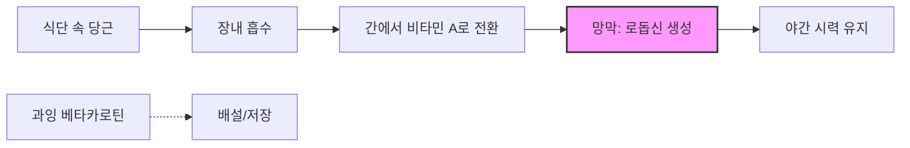

# 당근을 먹으면 눈이 좋아질까? 신화와 과학적 진실 사이

오랫동안 부모님들은 아이들에게 "당근을 먹으면 밤에도 잘 볼 수 있게 된다"며 채소를 남기지 않고 먹도록 권해왔습니다. 이러한 식습관에 관한 민담은 전 세계 문화에 깊숙이 뿌리내려 건강한 삶을 상징하는 관용구처럼 자리 잡았습니다. 하지만 이 주장에는 정말 과학적인 근거가 있을까요, 아니면 단순히 교묘한 전시 선전의 잔재일 뿐일까요? 당근과 눈 건강의 관계를 이해하기 위해서는 생물학, 역사, 그리고 영양학의 층위를 하나씩 벗겨내야 합니다.

## 생물학적 메커니즘: 베타카로틴과 로돕신

"당근이 시력을 좋게 한다"는 주장의 핵심은 당근에 풍부하게 함유된 베타카로틴에 있습니다. 우리가 당근을 섭취하면 우리 몸은 이 색소를 비타민 A(레티놀)로 전환합니다. 비타민 A는 망막에 존재하는 빛 흡수 분자인 '로돕신'의 핵심 성분으로, 어두운 곳에서의 시각(암소시)과 색각을 유지하는 데 필수적입니다.

비타민 A가 충분하지 않으면 우리 몸은 로돕신을 충분히 생성할 수 없으며, 이는 야맹증이라는 질환으로 이어집니다. 결핍이 심각할 경우 전반적인 눈 건강을 위협하는 상태로 진행될 수 있습니다. 그러나 여기서 중요한 점은 '시력 유지'와 '시력 개선'을 구분하는 것입니다. 이미 비타민 A 수치가 충분한 상태라면, 베타카로틴을 추가로 섭취한다고 해서 "슈퍼 시력"을 갖게 되지는 않습니다. 우리 몸은 베타카로틴을 비타민 A로 전환하는 과정을 조절하며, 생리적 필요량이 충족되면 과잉 섭취분은 대부분 저장되거나 배설됩니다. 특히 생당근에 포함된 베타카로틴 중 약 3%만이 소화 과정에서 방출되는데, 이는 조리 방식을 통해 개선할 수 있습니다.

### 영양소가 눈 건강에 미치는 영향 비교

| 영양소 | 주요 공급원 | 메커니즘 | 시력에 미치는 영향 |
| :--- | :--- | :--- | :--- |
| **베타카로틴** | 당근, 고구마 | 비타민 A의 전구체 | 야맹증 예방 |
| **루테인** | 시금치, 케일 | 청색광 필터링 | 황반 건강 지원 |
| **오메가-3** | 연어, 아마씨 | 항염 작용 | 안구건조증 완화 |
| **비타민 C** | 감귤류, 피망 | 항산화제 | 산화 스트레스로부터 보호 |

## 역사적 배경: 제2차 세계대전의 선전 기계

당근이 최고의 "눈 건강 식품"이라는 널리 퍼진 믿음은 부분적으로는 성공적인 군사 기만 작전의 산물입니다. 제2차 세계대전 당시 영국은 새로운 공중 요격 레이더 기술을 개발하여 야간에도 적기를 정확하게 격추할 수 있게 되었습니다.

영국 공군은 이 기술을 독일군으로부터 비밀로 유지하기 위해, 조종사들의 성공이 당근을 많이 먹는 식단 덕분이라는 보도 자료를 배포했습니다. 이 캠페인은 매우 효과적이어서 영국 대중들은 의무적인 등화관제 상황에서 자신의 야간 시력을 향상하기 위해 당근을 대량으로 소비하기 시작했습니다. 이 신화는 전쟁이 끝난 후에도 오랫동안 지속되었으며, 국가의 전쟁 노력을 지원하기 위해 채소 위주의 식단을 장려했던 정부 주도의 선전 활동으로 더욱 굳어졌습니다.

## 실질적인 적용: 섭취 최적화

당근이 야간 투시 능력을 주는 것은 아니지만, 여전히 균형 잡힌 식단의 중요한 부분입니다. 비타민 A는 지용성이기 때문에, 건강한 지방과 함께 당근을 섭취하면 베타카로틴의 생체 이용률이 크게 향상됩니다.

눈 건강을 위해 필요한 영양소 섭취를 추적하고 싶다면, 간단한 파이썬 스크립트를 사용하여 식단에 따른 베타카로틴 섭취량을 계산해 볼 수 있습니다.

```python
def calculate_beta_carotene(carrot_grams):
    """
    무게를 기준으로 베타카로틴 함량(mg)을 추정합니다.
    """
    # 평균 베타카로틴 함량은 다양하며, 0.08mg/g을 일반적인 추정치로 사용합니다.
    BETA_CAROTENE_PER_GRAM = 0.08
    total_mg = carrot_grams * BETA_CAROTENE_PER_GRAM
    return round(total_mg, 2)

# 예시: 일일 섭취량 계산
daily_intake = calculate_beta_carotene(150)
print(f"추정 베타카로틴 섭취량: {daily_intake}mg")
```

### 시각 경로: 단순화된 흐름

다음 다이어그램은 우리 몸이 망막 주기를 지원하기 위해 카로티노이드를 처리하는 과정을 보여줍니다.



## 주장에 대한 한계점

비타민 A가 눈 건강에 필수적이지만, 굴절 이상에 대한 만병통치약은 아니라는 점을 명심해야 합니다. 근시, 원시, 난시가 있다면 당근을 먹는다고 해서 안구의 모양이나 수정체의 초점이 변하지 않습니다. 이러한 상태는 구조적인 문제이므로 교정 수단이 필요합니다.

또한, 베타카로틴을 과도하게 섭취하면 피부가 일시적으로 노랗게 변하는 현상이 나타날 수 있습니다. 드물게는 식습관이 다른 신체 기능에 영향을 미치기도 하는데, 예를 들어 베타카로틴을 과다 섭취하면 대변이 오렌지색으로 보일 수 있습니다.

결론적으로, 당근이 초인적인 시력을 제공한다는 생각은 전시 기만에서 비롯된 신화이지만, 당근은 여전히 영양학적으로 매우 뛰어난 식품입니다. 결핍으로 인한 시력 저하를 예방하고 망막 단백질의 건강을 유지하는 데 필수적이지만, 정기적인 검진과 다양한 영양소가 포함된 식단을 포함하는 포괄적인 눈 관리의 한 부분으로 바라보아야 합니다.

## 참고자료

- [Wagon-wheel effect](https://en.wikipedia.org/wiki/Wagon-wheel%20effect)
- [Object permanence](https://en.wikipedia.org/wiki/Object%20permanence)
- [Human feces](https://en.wikipedia.org/wiki/Human%20feces)
- [Effect](https://en.wikipedia.org/wiki/Effect)
- [Streisand effect](https://en.wikipedia.org/wiki/Streisand%20effect)
- [Armstrong effect](https://en.wikipedia.org/wiki/Armstrong%20effect)
- [Visual perception](https://en.wikipedia.org/wiki/Visual%20perception)
- [Visual acuity](https://en.wikipedia.org/wiki/Visual%20acuity)
- [Night vision](https://en.wikipedia.org/wiki/Night%20vision)
- [Carrot](https://en.wikipedia.org/wiki/Carrot)
- [List of common misconceptions about science, technology, and mathematics](https://en.wikipedia.org/wiki/List%20of%20common%20misconceptions%20about%20science%2C%20technology%2C%20and%20mathematics)
- [Alternative versions of Superman](https://en.wikipedia.org/wiki/Alternative%20versions%20of%20Superman)