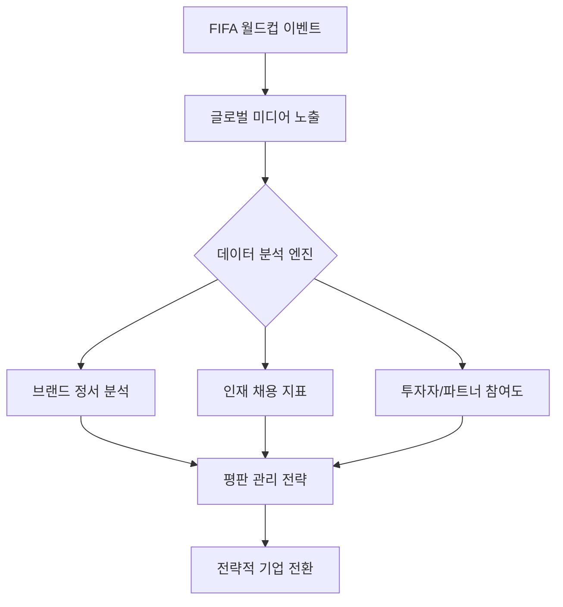

# 펌프 너머의 전략: 아람코와 같은 B2B 거인들이 FIFA 월드컵을 후원하는 이유

글로벌 마케팅이라는 치열한 전쟁터에서 FIFA 월드컵은 최고의 무대입니다. 한 달 동안 수십억 명의 시선이 화면에 고정되는 이 행사는 현대자동차나 코카콜라와 같은 소비재 브랜드에게는 더할 나위 없는 자연스러운 활동 무대입니다. 이러한 기업들은 일상적인 구매를 유도하기 위해 소비자들의 머릿속에 가장 먼저 떠오르는 브랜드가 되는 'Top of Mind' 전략에 의존합니다. 하지만 세계 최대 석유 생산 기업인 사우디 아람코(Saudi Aramco)가 경기장 광고판에 선명하게 이름을 올릴 때면, 많은 이들은 의아함을 느낍니다. 왜 B2B(기업 간 거래) 에너지 거대 기업이 일반 대중을 대상으로 수억 달러의 광고비를 지출하는 것일까요?

그 해답은 단순한 제품 판매를 넘어선 기업 전략의 정교한 변화에 있습니다. 이는 평판 관리, 지정학적 신호 전달, 그리고 새로운 에너지 미래로의 전환에 관한 이야기입니다.

## B2B 브랜드 자산의 작동 원리

아람코는 일반 운전자에게 소매용 휘발유를 직접 판매하지 않지만, 글로벌 공급망 깊숙이 자리 잡고 있습니다. B2B는 기업이 다른 기업을 고객 기반으로 삼는 상업 활동을 의미합니다. 아람코의 후원 전략은 개인이 연료 1갤런을 더 사게 만드는 것이 아니라, 기업의 미래에 영향력을 행사하는 B2B 생태계와 이해관계자들에게 영향을 주기 위해 설계되었습니다.

### 1. "운영을 위한 라이선스"와 평판
거대 에너지 기업에게 대중의 인식은 일종의 통화(currency)와 같습니다. 월드컵이 가진 명성과 글로벌 통합의 가치와 결합함으로써, 아람코는 브랜드에 인간적인 면모를 부여하고자 합니다. 이는 '얼굴 없는 석유 재벌'이라는 서사에서 '진보를 위한 글로벌 파트너'라는 서사로 전환하는 것입니다. 이는 화석 연료 추출에 회의적일 수 있는 국제 정부, NGO, 환경 규제 기관을 상대할 때 매우 중요합니다.

### 2. 인재 확보 및 유지
아람코는 단순한 석유 회사가 아니라 거대한 엔지니어링 및 기술 기업입니다. 시장 지배력을 유지하기 위해 전 세계 최고의 엔지니어, 데이터 과학자, 프로젝트 관리자를 두고 글로벌 기술 기업들과 경쟁해야 합니다. 글로벌 스포츠 이벤트에서의 높은 위상은 회사가 현대적이고 야심 차며, 글로벌 문화의 흐름 속에 있다는 신호를 보냄으로써 최고 수준의 글로벌 인재들에게 매력적인 고용주로 다가갈 수 있게 합니다.

### 3. 에너지 전환의 신호
무엇보다 중요한 것은 아람코가 이러한 플랫폼을 통해 자신의 변화를 알린다는 점입니다. 세계가 탈탄소화로 나아감에 따라 아람코는 수소, 탄소 포집, 재생 에너지 기술에 투자하고 있습니다. 세계에서 가장 많이 시청하는 행사를 후원함으로써, 그들은 자신들의 장기적인 목표를 전 세계에 알리고, 화석 연료 시대의 유물이 아닌 에너지 전환의 리더로서 기업의 이미지를 구축합니다.

## 비교: B2B vs B2C 후원 목적

| 특징 | B2C (예: 소매 브랜드) | B2B (예: 아람코) |
| :--- | :--- | :--- |
| **주요 목표** | 즉각적인 매출/시장 점유율 | 브랜드 정당성/파트너십 |
| **타겟 고객** | 일반 소비자 | 투자자, 정부, 인재 |
| **성공 지표** | 전환율, 매장 방문객 수 | 이해관계자 정서, ESG 등급 |
| **시간 범위** | 단기 (분기별) | 장기 (수십 년 단위) |

## 후원의 디지털 및 기술적 인프라

현대 스포츠 후원은 데이터 기반의 운영입니다. 아람코는 디지털 통합을 활용하여 후원의 '후광 효과(halo effect)'를 추적합니다. 아래는 B2B 기업이 글로벌 스포츠 이벤트의 영향을 추적하는 방식을 보여주는 단순화된 개념 모델입니다.



이러한 캠페인을 최적화하기 위해 기업들은 실시간 광고 송출과 정서 추적을 관리하는 구성 스크립트를 배포합니다. 정서 추적 대시보드를 위한 기본적인 구성은 다음과 같습니다.

```yaml
# 후원 영향 모니터링을 위한 개념적 구성
monitoring_system:
  target_event: "FIFA_World_Cup_2026"
  metrics:
    - social_sentiment_index
    - recruitment_portal_traffic
    - b2b_partner_inquiries
  data_sources:
    - twitter_api
    - linkedin_talent_analytics
    - internal_crm_leads
  thresholds:
    alert_sentiment_drop: -0.15
    conversion_goal: "increase_b2b_leads_by_15%"
```

## 역사적 맥락: 산업에서 정체성으로
역사적으로 B2B 기업들은 비공개 회의나 산업 박람회를 선호하며 그림자 속에 머물러 있었습니다. 그러나 21세기는 규칙을 바꾸었습니다. 글로벌 시장이 더욱 상호 연결됨에 따라 '기업 정체성'과 '국가 정체성' 사이의 경계가 모호해졌습니다.

사우디 아람코의 후원은 사우디아라비아의 '비전 2030'의 연장이기도 합니다. 글로벌 이벤트를 후원함으로써, 기업은 사우디를 현대적이고 개방적이며 투자가 준비된 국가로 홍보합니다. 이러한 맥락에서 후원은 단순히 석유에 관한 것이 아니라 국가 브랜딩에 관한 것입니다.

## 불확실한 주장과 향후 전망
이러한 대규모 후원의 직접적인 투자 수익률(ROI)은 금융 분석가들 사이에서 여전히 치열한 논쟁의 대상이라는 점을 유념해야 합니다. '브랜드 후광 효과'는 이론적으로 타당하지만, 월드컵 광고가 수십억 달러 규모의 프로젝트 계약에 정확히 얼마나 기여했는지 정량화하기는 어렵습니다. 나아가 일부 비평가들은 인권이나 환경 문제로 훼손된 평판을 개선하기 위해 스포츠를 이용하는 '스포츠워싱(Sportswashing)'이 언급되지 않은 진정한 목적이라고 주장합니다. 이러한 주장은 여전히 추측에 불과하며, 종종 해당 기업들에 의해 반박되기도 합니다.

결국, 월드컵에서 아람코의 존재는 현대 경제에서 가장 거대한 산업 거인들조차 소비자 브랜드처럼 행동해야 한다는 사실을 증명합니다. 차세대 엔지니어를 유치하든, 글로벌 투자자를 만족시키든, 혹은 청정 에너지로의 전환을 알리든, 'B2B'라는 꼬리표는 더 이상 글로벌 무대에서 빠져나갈 핑계가 되지 못합니다.

## 참고자료

- [Brazilian submarine Álvaro Alberto](https://en.wikipedia.org/wiki/Brazilian%20submarine%20%C3%81lvaro%20Alberto)
- [Acquisition of 21st Century Fox by Disney](https://en.wikipedia.org/wiki/Acquisition%20of%2021st%20Century%20Fox%20by%20Disney)
- [U.S. Strategic Bitcoin Reserve](https://en.wikipedia.org/wiki/U.S.%20Strategic%20Bitcoin%20Reserve)
- [Sponsor (commercial)](https://en.wikipedia.org/wiki/Sponsor%20%28commercial%29)
- [Fiscal sponsorship](https://en.wikipedia.org/wiki/Fiscal%20sponsorship)
- [Child sponsorship](https://en.wikipedia.org/wiki/Child%20sponsorship)
- [Yahoo](https://en.wikipedia.org/wiki/Yahoo)
- [Alibaba Group](https://en.wikipedia.org/wiki/Alibaba%20Group)
- [Peter Thiel](https://en.wikipedia.org/wiki/Peter%20Thiel)
- [DHL](https://en.wikipedia.org/wiki/DHL)
- [Sports marketing](https://en.wikipedia.org/wiki/Sports%20marketing)
- [Business-to-business](https://en.wikipedia.org/wiki/Business-to-business)