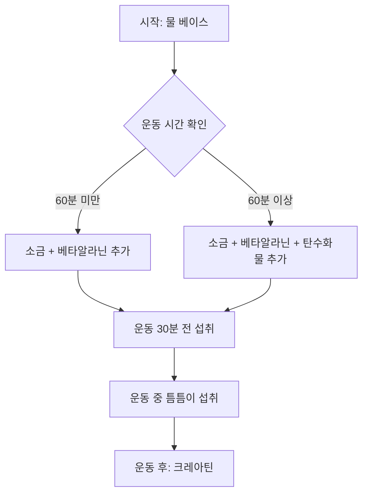

# DIY 프리워크아웃 음료: 전해질 및 에르고제닉 블렌드 분석

최고의 운동 수행 능력을 추구하는 과정에서 많은 피트니스 애호가들은 인공 감미료, 정체불명의 혼합물, 과도한 카페인이 포함된 상업용 프리워크아웃 보충제 대신 '직접 만든(DIY)' 대안을 선택하고 있습니다. 유기농 라임 주스, 핑크 솔트, 물, 베타알라닌, 크레아틴으로 구성된 귀하의 블렌드는 대사 지원을 위한 미니멀하고 과학적인 접근 방식을 잘 보여줍니다.

이 글에서는 귀하의 음료가 가진 생리학적 메커니즘을 분석하고, 그 효능을 평가하며, 운동 수행 능력을 최적화하기 위한 개선 방안을 제안합니다.

## 각 성분의 생리학적 메커니즘

이 혼합물이 효과를 내는 이유를 이해하려면 세포 생체 에너지학 및 체액 항상성 측면에서 각 성분의 역할을 분석해야 합니다.

### 1. 수분 공급과 전해질: 핑크 솔트와 물
히말라야 핑크 솔트는 주로 염화나트륨과 미량의 미네랄로 구성되어 있습니다. 나트륨은 혈액량을 유지하고 신경 전달 및 근육 수축에 필수적인 나트륨-칼륨 펌프를 촉진하는 주요 세포 외 전해질입니다. 운동 중 땀을 통해 나트륨이 손실되면 근육 경련과 피로가 발생할 수 있습니다.

### 2. 에르고제닉 보조제: 베타알라닌과 크레아틴
*   **베타알라닌:** 이 비단백질성 아미노산은 운동 수행 능력에서의 역할 때문에 종종 크레아틴과 함께 연구됩니다. 베타알라닌은 골격근 내에서 세포 내 pH 완충제 역할을 하는 카르노신의 전구체입니다. 고강도 운동 중에는 수소 이온($H^+$)이 축적되어 근육 pH를 낮추고 피로를 유발하는데, 베타알라닌 보충은 근육 내 카르노신 수치를 높이는 데 도움을 줍니다.
*   **크레아틴 모노하이드레이트:** 크레아틴은 무산소 운동 능력과 근육량을 향상시키는 것으로 잘 알려진 에르고제닉 보조제입니다. 근육 내 포스포크레아틴(PCr) 저장량을 증가시켜 짧고 폭발적인 에너지 분출 시 ATP를 빠르게 재합성할 수 있도록 돕습니다.

### 3. 대사 지원: 유기농 라임 주스
라임 주스는 풍미 외에도 소량의 비타민 C와 구연산을 제공합니다. 직접적인 에르고제닉 효과는 미미하지만, 산성 성분이 소화를 도울 수 있습니다. 다만, 운동 전후에 고용량의 항산화제를 섭취하는 것이 근육 적응에 미칠 수 있는 영향에 대해서는 현재 연구가 진행 중이라는 점을 유의해야 합니다.

## 보충제 프로필 비교 분석

| 성분 | 주요 기능 | 작용 기전 | 최적 섭취 시기 |
| :--- | :--- | :--- | :--- |
| **크레아틴** | ATP 재합성 | PCr 저장량 증가 | 매일 (타이밍보다 꾸준함이 중요) |
| **베타알라닌** | pH 완충 | 근육 카르노신 증가 | 매일 (따끔거림 방지를 위해 분할 섭취) |
| **나트륨(소금)** | 수분 공급 | 체액 균형/신경 신호 전달 | 운동 전/중 |
| **라임 주스** | 풍미 | 소화 보조 | 운동 전 |

## 실질적인 적용 및 개선 방안

귀하의 혼합물은 효과적이지만, 최신 스포츠 과학을 바탕으로 개선할 수 있는 부분들이 있습니다.

### '파레스테시아(Paresthesia)' 요소
베타알라닌은 피부가 따끔거리는 현상인 파레스테시아를 유발하는 것으로 알려져 있습니다. 1회 섭취량이 1.5g~2g을 초과하면 집중력을 방해할 수 있습니다. 또한, 베타알라닌은 포화 기반 보충제이므로 효과를 보기 위해 반드시 운동 직전에 섭취할 필요는 없으나, 많은 이들이 심리적 신호로 이 감각을 선호하기도 합니다.

### 제안하는 개선 사항
1.  **탄수화물 추가:** 운동 시간이 60분을 초과한다면, 빠르게 소화되는 탄수화물을 추가하여 글리코겐 저장량을 보충하는 것이 좋습니다.
2.  **타이밍 조정:** 크레아틴은 하루 중 꾸준히 섭취하는 것이 좋으며, 장기적인 근육 포화를 위해 식사와 함께 운동 후 섭취하는 것을 고려해 보십시오.
3.  **칼륨 포함:** 땀을 많이 흘리는 경우, 적절한 근육 기능을 위해 필요한 나트륨-칼륨 균형을 맞추기 위해 칼륨 공급원을 추가하는 것을 고려하십시오.

## 기술적 워크플로우: 보충제 혼합 로직

블렌드의 효능을 보장하기 위해, 다음 로직은 최적의 포화도와 흡수를 보장합니다.



```python
def calculate_preworkout_mix(duration_minutes, salt_grams, beta_alanine_grams):
    """
    운동 시간에 따른 전해질 필요량 조절을 위한 기본 로직.
    """
    base_water_ml = 500
    if duration_minutes > 90:
        salt_grams += 0.5  # 지구력 운동을 위해 나트륨 증가
    
    return {
        "water_ml": base_water_ml,
        "sodium_g": salt_grams,
        "beta_alanine_g": beta_alanine_grams
    }
```

## 역사적 배경
운동 수행을 위해 소금을 사용하는 관습은 고대부터 이어져 왔으며, 당시 선수들은 탈진을 막기 위해 소금물을 마셨습니다. 크레아틴의 과학적 공식화는 1990년대에 시작되어 파워리프팅과 보디빌딩 분야에 혁명을 일으켰습니다. 귀하의 블렌드는 전통적인 전해질 지혜와 20세기 스포츠 과학을 결합한 현대적인 합성물입니다.

*면책 조항: 본 제안은 정보 제공만을 목적으로 합니다. 특히 혈압 관련 기저 질환이 있는 경우, 고나트륨 섭취를 포함한 보충제 요법을 변경하기 전에 반드시 의료 전문가와 상담하십시오.*

## 참고자료

- [Self-efficacy](https://en.wikipedia.org/wiki/Self-efficacy)
- [Particle swarm optimization](https://en.wikipedia.org/wiki/Particle%20swarm%20optimization)
- [Hit to lead](https://en.wikipedia.org/wiki/Hit%20to%20lead)
- [Pre-workout](https://en.wikipedia.org/wiki/Pre-workout)
- [Comparing the Short-Term Effect of Creatine, Beta-Alanine, Combine Creatine*Beta-Alanine on Torque of Knee Extensor Muscles](https://doi.org/10.15373/2249555x/feb2014/103)
- [Zone Electrophoresis of Muscle Extracts : Separation of Phosphocreatine, Creatine, Beta-Alanine Peptides, and Nucleotides](https://doi.org/10.1038/173205a0)
- [The Effect Of Beta-alanine And Creatine Monohydrate Supplementation On Muscle Composition And Exercise Performance](https://doi.org/10.1249/00005768-200505001-01832)