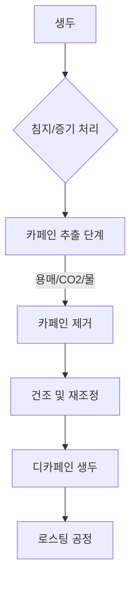

# 디카페인 커피의 과학: 카페인 제거의 진실을 밝히다

많은 커피 애호가들에게 커피를 내리는 의식은 단순히 카페인의 각성 효과를 얻기 위함이 아니라, 그윽한 향과 풍미, 그리고 따뜻함을 즐기는 과정입니다. 카페인에 민감한 분들이나 늦은 밤 커피를 즐기고 싶은 분들에게 '디카페인(Decaffeinated)' 커피는 오랫동안 사랑받아 온 필수품입니다. 하지만 커피 문화 속에는 여전히 잘못된 통념이 하나 자리 잡고 있습니다. 바로 커피 원두를 오래 볶는 '다크 로스트(Dark Roast)' 과정을 거치면 카페인이 타서 사라져 자연스럽게 디카페인 커피가 된다는 믿음입니다.

이번 글에서는 이러한 오해를 바로잡고, 카페인을 추출하는 정교한 화학적 공정을 살펴보며, 일반 커피와 디카페인 커피를 종합적으로 비교해 보겠습니다.

## 로스팅의 오해: 다크 로스트는 카페인이 적을까?

결론부터 말씀드리면 **아니오**입니다. 카페인은 매우 안정적인 알칼로이드 분자입니다. 다크 로스트(프렌치 로스트나 이탈리안 로스트 등)를 만드는 고온의 로스팅 과정에서도 카페인은 단순히 증발하거나 '타서 없어지지' 않습니다.

카페인이 휘발성을 띠는 것은 사실이지만, 카페인을 유의미하게 분해할 정도의 온도를 가한다면 커피 원두는 이미 숯덩이가 되어버릴 것입니다. 카페인을 제거할 수 있을 만큼 높은 온도에 도달했을 때쯤이면, 원두는 완전히 타버려 커피를 추출할 수 없는 상태가 됩니다.

다만, 부피와 무게에 따른 미묘한 차이는 존재합니다. 다크 로스트 원두는 더 오래 볶기 때문에 수분이 더 많이 빠져나가 밀도가 낮아집니다. 만약 커피를 '스쿱(부피)'으로 계량한다면, 다크 로스트는 라이트 로스트보다 물리적인 질량이 적어 카페인이 약간 적게 포함될 수 있습니다. 하지만 전문가들이 사용하는 표준 방식인 '무게'로 측정한다면, 같은 원산지의 라이트 로스트와 다크 로스트 사이의 카페인 함량은 사실상 동일합니다. 일반적으로 다크 로스트 커피가 라이트 로스트보다 아주 미세하게 카페인이 적을 수는 있으나, 소비자가 체감할 수 있는 차이는 거의 없습니다.

## 디카페인 공정은 어떻게 이루어지는가

로스팅이 답이 아니라면, 카페인은 어떻게 제거되는 것일까요? 핵심 과제는 커피 고유의 풍미와 향을 담당하는 수백 가지 화합물은 그대로 둔 채 카페인만 선택적으로 제거하는 것입니다. 대부분의 디카페인 공정은 원두가 아직 '그린 빈(생두)' 상태일 때 이루어집니다.

### 일반적인 디카페인 공정

1.  **용매 추출법 (직접/간접):** 염화메틸렌이나 초산에틸과 같은 화학 용매를 사용하여 카페인 분자와 결합해 제거합니다.
2.  **스위스 워터 프로세스 (Swiss Water Process):** 삼투압 현상과 '그린 커피 추출물(GCE)'을 활용하여 탄소 필터를 통해 카페인을 걸러내는 방식입니다.
3.  **초임계 이산화탄소(CO2) 공정:** 압력을 가한 이산화탄소를 선택적 용매로 사용하여, 풍미 오일은 보존하면서 카페인만 타겟팅하여 제거합니다.

아래는 카페인 추출 공정을 개념적으로 나타낸 흐름도입니다.



### 비교 분석: 일반 커피 vs 디카페인 커피

| 특징 | 일반 커피 | 디카페인 커피 |
| :--- | :--- | :--- |
| **카페인 함량** | 높음 (원두/추출 방식에 따라 다름) | 감소됨 (보통 97% 이상 제거) |
| **풍미 프로필** | 원산지 고유의 풍미 유지 | 다소 순함; 공정에 따라 다름 |
| **화학적 안정성** | 매우 안정적 | 안정적이나 공정으로 인해 다공성 증가 |
| **로스팅 시간** | 표준 | 세심한 모니터링 필요 |
| **가공 여부** | 없음 (수확 후 바로) | 필요 (로스팅 전) |

*참고: 디카페인화는 로스팅 전 생두 상태에서 카페인을 추출하는 과정입니다. 카페인의 각성 효과를 피하고자 하는 분들을 위해 다양한 디카페인 제품이 시중에 나와 있습니다.*

## 기술적 고려 사항: 추출 모니터링

커피 화학에 관심이 있는 분들을 위해, 간단한 파이썬 함수를 사용하여 카페인 추출률을 모델링해 볼 수 있습니다. 이는 실험실에서 용매 기반 추출 과정 중 시간($t$)에 따른 카페인 농도를 추적하는 방식을 가상으로 표현한 것입니다.

```python
def calculate_caffeine_removal(initial_caffeine, time_minutes, efficiency_constant):
    """
    1차 붕괴 모델을 기반으로 생두 내 카페인 농도를 시뮬레이션합니다.
    """
    import math
    
    # 최종 카페인 = 초기값 * e^(-kt)
    final_caffeine = initial_caffeine * math.exp(-efficiency_constant * time_minutes)
    return round(final_caffeine, 2)

# 예시: 카페인 100mg, 120분 공정, 효율 상수 0.03
result = calculate_caffeine_removal(100, 120, 0.03)
print(f"남은 카페인: {result}mg")
```

## 실용적인 예시 및 고려 사항

디카페인 커피를 구매할 때는 어떤 공정을 거쳤는지 명시된 라벨을 확인하는 것이 좋습니다. '스위스 워터 프로세스'는 합성 용매를 사용하지 않고 물과 탄소 필터만을 사용하기 때문에 스페셜티 커피 로스터들에게 높게 평가받습니다.

홈 로스팅을 즐기시는 분들이라면, 원두를 과하게 볶아 '디카페인'을 시도하지 마십시오. 이는 쓰고 아린 맛이 나는 커피를 만들 뿐입니다. 다크 로스트의 풍미를 선호하면서 카페인 섭취를 줄이고 싶다면, CO2나 물을 이용한 공법으로 처리되어 원두의 구조와 풍미가 잘 보존된 고품질의 디카페인 원두를 구매하는 것이 가장 좋은 방법입니다.

*면책 조항: 로스팅 중 카페인의 안정성에 관한 정보는 식품 과학계에서 널리 받아들여지고 있으나, 디카페인 커피에 남아 있는 미량의 카페인에 대한 개인의 생물학적 반응은 다를 수 있습니다. 건강상의 이유로 카페인 섭취를 엄격히 제한해야 하는 경우 반드시 의료 전문가와 상담하십시오.*

## 참고자료

- [Coffee roasting](https://en.wikipedia.org/wiki/Coffee%20roasting)
- [Coffee](https://en.wikipedia.org/wiki/Coffee)
- [Espresso machine](https://en.wikipedia.org/wiki/Espresso%20machine)
- [Decaffeination](https://en.wikipedia.org/wiki/Decaffeination)
- [List of coffee drinks](https://en.wikipedia.org/wiki/List%20of%20coffee%20drinks)
- [Coffee production](https://en.wikipedia.org/wiki/Coffee%20production)
- [History of coffee](https://en.wikipedia.org/wiki/History%20of%20coffee)
- [Luckin Coffee](https://en.wikipedia.org/wiki/Luckin%20Coffee)
- [Caffeinated drink](https://en.wikipedia.org/wiki/Caffeinated%20drink)
- [Caffeine](https://en.wikipedia.org/wiki/Caffeine)
- [Vietnamese iced coffee](https://en.wikipedia.org/wiki/Vietnamese%20iced%20coffee)
- [Caffeine toxicity](https://en.wikipedia.org/wiki/Caffeine%20toxicity)