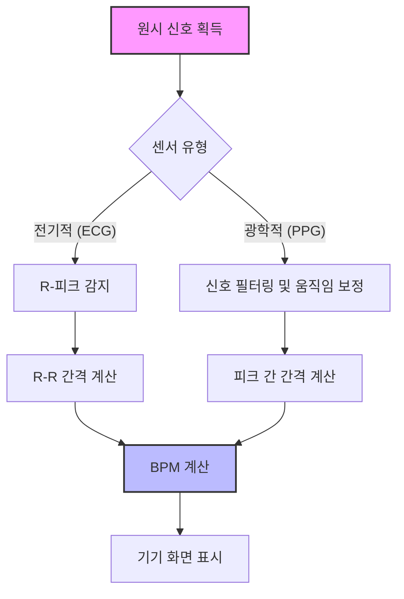

# 심장박동의 해독: Garmin HRM-Pro와 애플워치 심박수 센싱 비교 분석

웨어러블 기술의 세계에서 심박수만큼 면밀하게 분석되는 지표는 드뭅니다. 무산소 역치를 돌파하려는 엘리트 운동선수든, 일상적인 활동을 추적하는 일반인이든, 자신의 기기가 어떻게 맥박을 측정하는지 이해하는 것은 매우 중요합니다. Garmin HRM-Pro와 애플워치는 생체 인식 모니터링에 있어 서로 다른 두 가지 철학을 대변합니다. 바로 가슴에 착용하는 전용 심전도(ECG) 센서와 손목 기반의 광혈류측정(PPG) 배열입니다.

두 기기 모두 심혈관 성능을 정확하게 나타내는 것을 목표로 하지만, 데이터를 획득하는 물리적 메커니즘은 근본적으로 다릅니다.

## 측정 메커니즘: 전기적 방식 vs 광학적 방식

### Garmin HRM-Pro: 전기적 센싱의 표준
Garmin HRM-Pro는 심전도(ECG) 방식을 사용합니다. 심장이 뛸 때마다 심장 근육의 수축을 유발하는 전기적 신호가 발생합니다. HRM-Pro는 패브릭 스트랩에 통합된 전도성 전극을 갖추고 있습니다. 이 전극을 피부에 밀착시켜 착용하면(보통 땀이나 전도성 젤로 습기가 있는 상태), 전극이 심장의 전기적 활동을 직접 감지합니다. 이 방식은 심장의 전기적 신호를 직접 측정하기 때문에, 특히 고강도 인터벌 트레이닝(HIIT)이나 심박수가 급격히 변하는 상황에서 매우 정확한 심박수 모니터링 방법으로 간주됩니다.

### 애플워치: 광혈류측정(PPG)의 범용성
애플워치는 주로 광혈류측정(PPG) 기술에 의존합니다. 이 광학 기술은 LED 조명과 빛에 민감한 포토다이오드를 함께 사용합니다. 심장이 뛸 때 손목의 혈류량이 증가하면 조직에 흡수되는 빛의 양이 많아집니다. 심장 박동 사이에는 혈액량이 감소하여 더 많은 빛이 센서로 반사됩니다. 애플워치는 이러한 빛의 흡수율을 샘플링하여 심박수를 계산합니다. 애플워치 역시 디지털 크라운에 단일 유도 ECG 스냅샷을 위한 전기 센서를 탑재하고 있지만, 운동 중 지속적인 배경 심박수 모니터링은 여전히 광학적 방식을 따릅니다.

## 비교 개요

| 특징 | Garmin HRM-Pro | 애플워치 (PPG 기반) |
| :--- | :--- | :--- |
| **주요 방식** | 전기적 방식 (ECG) | 광학적 방식 (PPG) |
| **착용 위치** | 가슴 (흉골) | 손목 |
| **적합한 용도** | HIIT, 단거리 달리기, 고중량 웨이트 | 일상 추적, 러닝, 사이클링 |
| **신호 무결성** | 높음 (직접 접촉) | 가변적 (움직임에 따른 노이즈) |

## 기술적 로직 및 데이터 흐름

이 기기들이 데이터를 처리하는 방식을 이해하기 위해, 웨어러블이 원시 신호를 심박수(BPM) 값으로 변환하는 과정을 단순화한 로직 흐름을 살펴보겠습니다.



소프트웨어 환경에서 개발자들은 손목 움직임으로 인해 발생하는 '노이즈'를 제거하기 위해 필터링을 거쳐 PPG 데이터를 처리합니다. 이 필터링 과정을 의사 코드(pseudo-code)로 표현하면 다음과 같습니다.

```python
def calculate_bpm(raw_signal, sampling_rate=100):
    # 움직임 노이즈를 제거하기 위한 대역 통과 필터 적용
    filtered_signal = bandpass_filter(raw_signal, low=0.5, high=4.0)
    
    # 신호에서 피크(정점) 식별
    peaks = find_peaks(filtered_signal)
    
    # 피크 사이의 평균 시간 계산
    intervals = np.diff(peaks)
    bpm = 60 / (np.mean(intervals) / sampling_rate)
    
    return bpm
```

## 실제적 의미와 정확도

과거에는 운동 중 신뢰할 수 있는 심박수 데이터를 얻기 위해 가슴 스트랩이 주된 방법이었습니다. 광학 센서는 한때 임상 장비에만 사용되었으나, '웨어러블 혁명'을 통해 PPG 기술이 소비자용 피트니스 기기에 도입되었습니다. 그러나 광학 센서는 '움직임 아티팩트(motion artifacts)'에 취약할 수 있습니다. 전력 질주 중 팔을 흔들면 시계가 움직이면서 데이터에 공백이 생길 수 있습니다. Garmin HRM-Pro는 팔의 움직임과 관계없이 비교적 안정적인 몸통(흉부)에 위치함으로써 이러한 문제를 피합니다.

애플워치와 같은 소비자용 기기에 대한 검증 연구는 현재도 계속 진행 중이라는 점을 유의해야 합니다. 일부 연구에서는 심박수 및 에너지 소비량에 대한 기기의 정확도를 조사했지만, 휠체어 추진이나 특정 심혈관 질환 등 사용자의 활동에 따라 성능이 달라질 수 있습니다. 또한 문신을 포함한 피부 상태가 애플워치 광학 센서의 성능에 영향을 줄 수 있다는 점도 사용자는 인지해야 합니다.

## 결론
성능 지표의 정밀도가 최우선이라면, 전기적 센싱 메커니즘을 사용하는 Garmin HRM-Pro가 여전히 강력한 선택지입니다. 반면 건강 데이터를 라이프스타일 생태계에 매끄럽게 통합하는 것이 우선이라면, 애플워치의 PPG 시스템은 일반적인 피트니스 추적에 매우 효과적이며 편리함과 다기능성을 제공합니다.

## 참고자료

- [Heart rate monitor](https://en.wikipedia.org/wiki/Heart%20rate%20monitor)
- [Comparison](https://en.wikipedia.org/wiki/Comparison)
- [Comparison of ICBMs](https://en.wikipedia.org/wiki/Comparison%20of%20ICBMs)
- [File comparison](https://en.wikipedia.org/wiki/File%20comparison)
- [Estimation of Heart Rate Variability Measures Using Apple Watch and Evaluating Their Accuracy](https://doi.org/10.1145/3453892.3462647)
- [Accuracy of Apple Watch Measurements for Heart Rate and Energy Expenditure in Patients With Cardiovascular Disease: Cross-Sectional Study (Preprint)](https://doi.org/10.2196/preprints.11889)
- [Accuracy of the Apple Watch Series 4 and Fitbit Versa for Assessing Energy Expenditure and Heart Rate of Wheelchair Users During Treadmill Wheelchair Propulsion: Cross-sectional Study (Preprint)](https://doi.org/10.2196/preprints.52312)