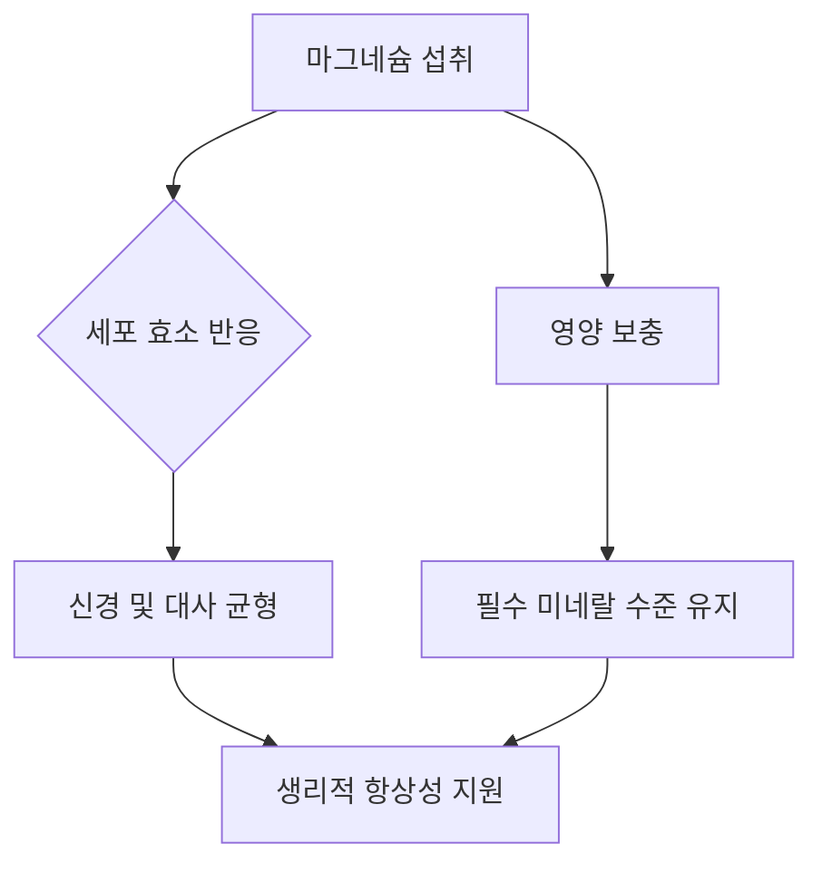

# 밤의 마그네슘 과학: 회복력 있는 수면의 열쇠를 찾아서

수년 동안 마그네슘은 웰니스 분야에서 심신의 이완을 돕는 미네랄로 꾸준히 언급되어 왔습니다. 인체 내 300가지 이상의 효소 반응에 관여하는 필수 미네랄로서, 대사 및 신경계의 균형을 유지하는 마그네슘의 역할은 이미 잘 알려진 사실입니다. 최근에는 자기 전 마그네슘을 섭취하는 트렌드가 단순한 웰니스 담론을 넘어, 일상적인 수면 위생(Sleep Hygiene)의 영역으로까지 확장되었습니다. 그렇다면 과학적으로 볼 때 자기 전 마그네슘 섭취는 어떤 의미를 가지며, 우리 몸의 내부 생물학적 과정과 어떻게 상호작용하는 것일까요?

## 생화학적 메커니즘: 마그네슘은 우리 몸과 어떻게 상호작용하는가

수면과 관련하여 마그네슘의 잠재적 역할 중 가장 주목받는 부분은 신경전달물질인 가바(GABA, 감마-아미노뷰티르산)와의 상호작용입니다. 가바는 중추신경계의 주요 억제성 신경전달물질로, 뇌의 활동 속도를 늦추는 일종의 '브레이크' 역할을 합니다.

마그네슘은 수많은 효소 반응의 보조 인자(cofactor)로 알려져 있지만, 수면에 미치는 구체적인 영향에 대한 연구는 여전히 진행 중입니다. 마그네슘은 신경 및 대사 균형을 위해 반드시 필요한 미네랄입니다. 일부 연구자들은 마그네슘이 신경 흥분성에 영향을 미치는 수용체를 조절하는지 여부를 조사하고 있습니다. 신체의 기본적인 생리 기능을 지원함으로써, 마그네슘은 휴식에 도움이 되는 환경을 조성하는 데 기여할 수 있습니다.

신경전달물질 외에도 마그네슘은 신체의 전반적인 항상성 유지에 필수적입니다. 만성적인 스트레스는 생리적 긴장을 유발할 수 있으며, 일반적인 건강을 위해 필수 미네랄의 적정 수준을 유지하는 것은 표준적인 권장 사항입니다.

### 마그네슘 형태별 비교

모든 마그네슘 보충제가 동일한 것은 아닙니다. 화학적 화합물에 따라 생체 이용률과 특성이 크게 달라집니다.

| 마그네슘 형태 | 생체 이용률 | 주요 특징 |
| :--- | :--- | :--- |
| **마그네슘 글리시네이트** | 높음 | 생체 이용률이 매우 높은 형태 |
| **마그네슘 시트레이트** | 보통 | 건강기능식품에 자주 사용됨 |
| **마그네슘 옥사이드** | 낮음 | 흡수율이 낮은 편 |
| **마그네슘 글루코네이트** | 보통 | 흔히 사용되는 마그네슘 염 |

*참고: 수면을 위한 이러한 특정 형태의 효과는 여전히 연구 중이며, 개인별 내성은 크게 다를 수 있습니다.*

## 역사적 배경과 현대적 적용

마그네슘은 1808년 험프리 데이비 경에 의해 처음 분리되었지만, 전통적인 맥락에서의 사용은 훨씬 이전부터 시작되었습니다. 오늘날 우리는 마그네슘이 세포의 에너지 화폐인 아데노신 삼인산(ATP) 생성의 보조 인자라는 점을 이해하고 있습니다. 에너지 생성에 관여하는 미네랄이 수면을 돕는다는 것이 다소 모순적으로 보일 수 있지만, 세포 효율성을 높이는 이러한 역할이야말로 신체가 회복 상태에 필요한 생리적 균형을 유지하도록 돕는 핵심입니다.

### 실질적인 적용: "수면 위생" 구성

마그네슘을 일상에 도입하려면 복용량과 개인의 건강 상태를 고려해야 합니다. 대부분의 일반적인 권장 사항은 전문가와 상담하여 적절한 섭취량을 결정할 것을 제안합니다.

```python
# 보충제 섭취를 추적하기 위한 간단한 구성 스크립트
class SleepProtocol:
    def __init__(self, supplement_name, dosage_mg):
        self.supplement = supplement_name
        self.dosage = dosage_mg

    def display_routine(self):
        print(f"{self.dosage}mg의 {self.supplement} 섭취에 관하여 전문가와 상담하십시오.")

# 사용 예시
magnesium_routine = SleepProtocol("마그네슘 글리시네이트", 300)
magnesium_routine.display_routine()
```

다음 다이어그램은 마그네슘과 생리적 균형 사이의 관계를 보여줍니다.



## 잠재적 불확실성과 향후 연구

경험적인 관심은 매우 높지만, 과학계는 여전히 신중한 입장을 취하고 있습니다. 마그네슘에 관한 현재 데이터의 대부분은 직접적인 수면제로서의 역할보다는 필수 미네랄로서의 기능에 초점을 맞춘 연구에서 비롯된 것입니다. 이미 식단을 통해 마그네슘을 충분히 섭취하고 있는 건강한 사람들에게 보충제 섭취가 수면의 질을 유의미하게 개선할 수 있는지에 대해서는 아직 완전히 밝혀지지 않았습니다.

더욱이 "수면의 질"은 복합적인 지표입니다. 마그네슘은 필수 영양소이지만, 수면 구조에 미치는 구체적인 영향을 확인하기 위해서는 더 엄격하고 대규모인 이중 맹검 위약 대조 시험이 필요합니다. 마그네슘은 항생제나 혈압약 등 특정 약물과 상호작용할 수 있으므로, 새로운 보충제 섭취를 시작하기 전에는 반드시 의료 전문가와 상담하십시오.

결론적으로, 마그네슘은 생리적 건강을 위한 기초적인 미네랄입니다. 필수적인 효소 기능을 지원함으로써, 마그네슘은 전반적인 웰빙을 유지하려는 사람들에게 여전히 중요한 연구 대상입니다.

## 참고자료

- [Sleep deprivation](https://en.wikipedia.org/wiki/Sleep%20deprivation)
- [Bedtime procrastination](https://en.wikipedia.org/wiki/Bedtime%20procrastination)
- [Sleepy girl mocktail](https://en.wikipedia.org/wiki/Sleepy%20girl%20mocktail)
- [Benefit](https://en.wikipedia.org/wiki/Benefit)
- [Magnesium Glycinate](https://doi.org/10.22541/au.175494709.93626317/v1)
- [Magnesium Glycinate](https://doi.org/10.32388/0ja21q)
- [Structural characterization of calcium glycinate, magnesium glycinate and zinc glycinate](https://doi.org/10.1142/s1793545816500528)