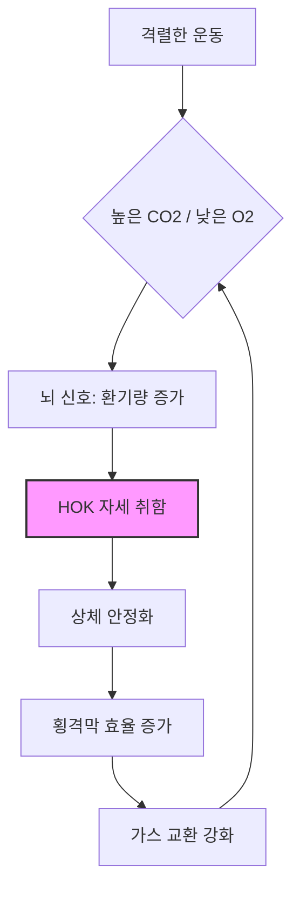

# "무릎에 손을 얹는" 회복 자세의 과학: 격렬한 운동 후 몸을 숙이는 이유

고강도 인터벌 트레이닝이나 전력 질주를 마친 직후, 본능적으로 몸을 웅크리고 무릎에 손을 얹어본 적이 있나요? 이는 전 세계 모든 사람에게서 나타나는 보편적인 반사 행동입니다. 전문 운동선수든 가벼운 운동을 즐기는 일반인이든, 심박수가 치솟고 폐가 타들어 가는 듯한 느낌이 들면 우리 몸은 마치 약속이라도 한 듯 이 자세를 취합니다. 도대체 왜 이런 자세를 취하는 걸까요? 이것은 단순히 패배의 표시일까요, 아니면 더 빨리 회복할 수 있도록 돕는 정교한 생리학적 메커니즘이 숨어 있는 것일까요?

## 호흡 효율성의 역학

격렬한 운동을 할 때 우리 근육은 평소보다 훨씬 많은 산소를 요구하며, 몸은 그 결과로 생성된 이산화탄소를 배출하기 위해 과부하 상태로 작동합니다. 이로 인해 호흡 곤란 상태가 발생합니다. 흔히 '무릎에 손을 얹는(Hands-on-Knees, HOK)' 자세라고 불리는 이 동작은 단순히 숨을 고르려는 시도가 아니라, 호흡기 시스템을 기계적으로 최적화하는 행위입니다.

### 횡격막과 흉강
똑바로 서 있는 자세에서는 호흡의 주동근인 횡격막이 중력과 복부 장기의 무게를 이겨내며 작동해야 합니다. 몸을 숙여 무릎에 손을 얹으면 상체를 효과적으로 '고정'하게 됩니다. 이러한 안정화는 늑간근, 목, 어깨 근육과 같은 보조 호흡근이 더 효율적으로 작동할 수 있는 환경을 만들어 줍니다.

팔을 고정함으로써 흉곽을 더 효과적으로 움직일 수 있는 안정적인 기반이 마련되며, 이는 한 번의 호흡으로 들이마시고 내뱉을 수 있는 공기의 양을 잠재적으로 증가시킵니다. 이를 '역 기시-정지(reverse origin-insertion)' 역학이라고 합니다. 평소 팔을 움직이는 데 사용되던 근육들이 흉곽을 안정시키는 데 재배치되어, 주 호흡근이 오로지 환기에만 집중할 수 있게 해주는 원리입니다.

### 비교: 똑바로 서서 회복하기 vs. 무릎에 손 얹기(HOK)

| 특징 | 똑바로 서기 | 무릎에 손 얹기(HOK) |
| :--- | :--- | :--- |
| **횡격막 부하** | 높음 (중력과 싸워야 함) | 낮음 (상체 각도로 안정화됨) |
| **보조 근육** | 주로 자세 유지 | 주로 호흡 및 안정화 |
| **흉곽 확장** | 자세에 의해 제한됨 | 흉곽 고정을 통해 극대화됨 |
| **회복 속도** | 느림 | 빠름 (예비 연구 결과 기반) |
| **코어 개입** | 최소화 | 높음 (안정화 필요) |

*참고: 많은 전문가가 회복을 위해 HOK 자세가 더 우월하다고 제안하지만, 개인의 선호도와 운동의 구체적인 특성 또한 회복 결과에 중요한 역할을 합니다.*

## 역사적 맥락과 진화론적 관점

'무릎에 손을 얹는' 자세는 종종 코치나 전통주의자들에게 '나약함'의 표시로 간주되곤 합니다. 많은 스포츠 문화에서 허리에 손을 얹고 당당하게 서 있는 것이 지배력과 정신력을 보여주는 '올바른' 회복 자세로 여겨집니다. 하지만 이는 생리학적 근거보다는 문화적 구성물에 가깝습니다.

진화론적으로 인간은 지구력을 위해 설계되었습니다. 열을 발산하고 산소 부채를 관리하는 능력은 우리 종의 특징입니다. HOK 자세는 포식자로부터 도망치거나 사냥감을 쫓는 등 격렬한 활동 후 산소 섭취를 극대화하여, 개인이 최대한 빨리 정상적인 상태로 돌아올 수 있게 하는 조상 대대로 내려온 적응일 수 있습니다. 현대 스포츠에서 이 자세에 가해지는 낙인은 생물학적 현실을 반영하기보다는, 선수들이 피로를 드러내지 못하게 하려는 심리적 훈련 도구일 가능성이 큽니다.

## 기술 모델링: 호흡 피드백 루프

우리 몸이 이 과정을 어떻게 관리하는지 이해하기 위해 호흡 피드백 루프를 살펴볼 수 있습니다. 이산화탄소 수치가 상승하면 뇌는 환기량을 늘리라는 신호를 보냅니다. HOK 자세는 이 루프를 위한 '하드웨어 최적화' 역할을 합니다.



### 실전 적용: 회복 최적화 방법
세트 사이의 회복을 극대화하려면 다음 단계를 따르세요:
1. **안정화:** 발을 어깨너비로 벌립니다.
2. **고정:** 손이나 팔뚝을 무릎 위에 단단히 얹습니다.
3. **정렬:** 복부가 너무 강하게 압박되지 않도록 척추를 비교적 중립 상태로 유지합니다.
4. **호흡:** 얕고 빠른 흉식 호흡보다는 깊고 리듬감 있는 횡격막 호흡(복식 호흡)에 집중합니다.

### 코드: 회복 심박수 시뮬레이션 (Python)
폐를 직접 측정할 수는 없지만, 간단한 감쇠 모델을 사용하여 회복 추세를 시뮬레이션할 수 있습니다.

```python
import matplotlib.pyplot as plt

def simulate_recovery(time_steps, recovery_rate):
    hr = [180] # 시작 심박수
    for t in range(1, time_steps):
        # 회복은 로그 감쇠를 따름
        new_hr = hr[-1] - (recovery_rate * (180 - 60) / 100)
        hr.append(max(60, new_hr))
    return hr

# HOK 자세는 'recovery_rate' 상수를 증가시킬 수 있음
recovery_data = simulate_recovery(60, 2.5) 
print(f"60초 후 심박수: {recovery_data[-1]:.0f} BPM")
```

## 결론: 반사 행동의 사실 확인
몸을 숙이는 본능은 대사 스트레스에 대한 정교한 생물학적 반응입니다. 상체를 고정함으로써 우리는 호흡근의 작업 부하를 줄이고, 더 효율적인 가스 교환을 가능하게 합니다. '허리에 손을 얹는' 자세가 시각적으로는 선호될지 몰라도, 사회적 신호보다 생리학적 회복을 우선시하는 사람들에게는 '무릎에 손을 얹는' 방식이 과학적으로 더 타당합니다. 엘리트 선수들의 생체 역학 연구가 계속됨에 따라, 임의적인 미적 규칙을 따르는 것보다 이러한 타고난 신체 신호에 귀를 기울이는 것이 훨씬 현명하다는 사실이 분명해지고 있습니다.

## 참고자료

- [Strength training](https://en.wikipedia.org/wiki/Strength%20training)
- [Running](https://en.wikipedia.org/wiki/Running)
- [Massage](https://en.wikipedia.org/wiki/Massage)
- [Powerlifting](https://en.wikipedia.org/wiki/Powerlifting)
- [Rheumatoid arthritis- hands and knees](https://doi.org/10.53347/rid-151677)
- [Untitled](https://doi.org/10.7717/peerj.25/table-2)
- [Del got on his hands and knees](https://doi.org/10.14321/j.ctv7xbs3s.23)