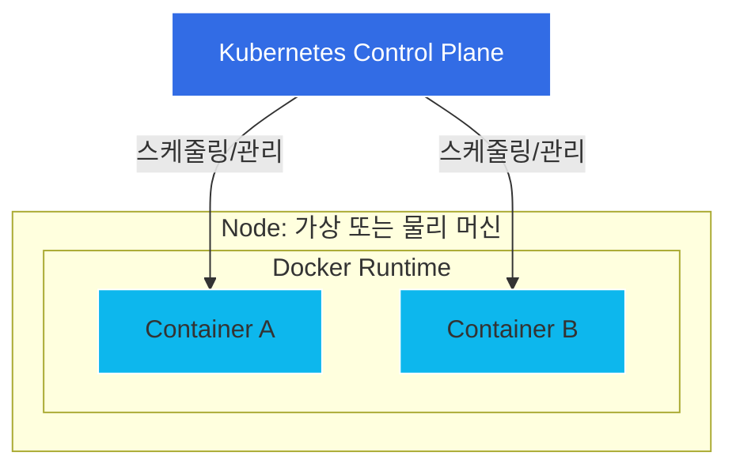

# 컨테이너화의 이해: Docker와 Kubernetes 알아보기

현대 클라우드 네이티브 개발 환경에서 "Docker(도커)"와 "Kubernetes(쿠버네티스)"라는 용어는 항상 함께 언급됩니다. 두 기술 모두 컨테이너 생태계의 핵심 기둥이지만, 그 목적은 근본적으로 다릅니다. 이들의 관계를 이해하기 위해서는 먼저 전통적인 가상화 방식에서 컨테이너화로의 전환 과정을 이해해야 합니다.

## Docker: 컨테이너화의 엔진

2013년에 등장한 Docker는 소프트웨어를 패키징하고 배포하는 방식을 근본적으로 바꾸어 놓았습니다. Docker 이전에는 개발자들 사이에서 "내 컴퓨터에서는 잘 되는데?"라는 문제가 빈번했습니다. 이는 개발자의 노트북에서는 코드가 완벽하게 작동하지만, 환경 설정의 차이로 인해 운영 환경에서는 실패하는 상황을 의미합니다.

### Docker의 작동 원리
Docker는 OS 수준의 가상화를 사용하여 "컨테이너"라는 패키지에 소프트웨어를 담아 전달합니다. 전체 게스트 운영 체제가 필요한 가상 머신(VM)과 달리, 컨테이너는 호스트 시스템의 커널을 공유하면서 애플리케이션 프로세스를 격리합니다.

Docker 컨테이너는 이미지를 빌드하기 위한 지침이 담긴 간단한 텍스트 파일인 `Dockerfile`에 의해 정의됩니다.

```dockerfile
# 파이썬 애플리케이션을 위한 예시 Dockerfile
FROM python:3.9-slim
WORKDIR /app
COPY . .
RUN pip install -r requirements.txt
CMD ["python", "app.py"]
```

코드, 런타임, 시스템 도구 및 라이브러리를 단일 이미지로 패키징함으로써, Docker는 환경에 관계없이 애플리케이션이 동일하게 실행되도록 보장합니다.

## Kubernetes: 오케스트레이션 계층

Docker가 단일 컨테이너를 빌드하고 실행하는 도구라면, Kubernetes(고대 그리스어로 '키잡이' 또는 '조종사'를 뜻하는 단어에서 유래했으며 흔히 K8s로 줄여 부름)는 컨테이너 클러스터를 관리하기 위한 플랫폼입니다. Kubernetes는 구글에서 개발한 오픈 소스 컨테이너 오케스트레이션 플랫폼입니다.

### 왜 오케스트레이션이 필요한가?
애플리케이션이 확장됨에 따라 컨테이너를 수동으로 관리하는 것은 불가능해집니다. 다음과 같은 문제를 해결해야 하기 때문입니다.
*   **서비스 디스커버리(Service Discovery):** 컨테이너들이 서로를 어떻게 찾는가?
*   **로드 밸런싱(Load Balancing):** 여러 인스턴스에 트래픽을 어떻게 분산할 것인가?
*   **자가 치유(Self-healing):** 컨테이너가 충돌하면 어떻게 되는가?
*   **스케일링(Scaling):** 트래픽이 급증할 때 어떻게 복제본을 추가할 것인가?

Kubernetes는 이러한 운영 작업을 자동화합니다. Kubernetes는 "선언적(declarative)" 모델로 작동합니다. 즉, 클러스터의 원하는 상태(예: "웹 서버 복제본 3개를 원함")를 정의하면, Kubernetes는 현재 상태를 원하는 상태와 일치시키기 위해 지속적으로 작동합니다.

### 관계: 시각적 개요

다음 다이어그램은 Docker가 어떻게 런타임 환경을 제공하고, Kubernetes가 어떻게 관리 평면(Management Plane) 역할을 하는지 보여줍니다.



## 비교 분석: Docker vs. Kubernetes

이를 "Docker와 Kubernetes의 경쟁"으로 보는 것은 흔한 오해입니다. 실제로는 상호 보완적인 기술입니다. Docker는 컨테이너 런타임(엔진)이고, Kubernetes는 오케스트레이션 시스템(함대 관리자)입니다.

| 기능 | Docker | Kubernetes |
| :--- | :--- | :--- |
| **주요 목표** | 패키징 및 실행 | 오케스트레이션 및 관리 |
| **범위** | 단일 노드(일반적으로) | 다중 노드 클러스터 |
| **스케일링** | 수동 | 자동화 |
| **자가 치유** | 수동 재시작 | 자동 재시작/재스케줄링 |
| **복잡성** | 낮음 | 높음 |

*참고: Docker Swarm은 Docker에 포함된 기본 오케스트레이션 도구이지만, 일반적으로 엔터프라이즈급 배포에서는 Kubernetes보다 기능이 부족하다고 평가받습니다.*

## 실무 예시: 배포 워크플로우

일반적인 전문 개발 워크플로우는 다음과 같은 단계를 따릅니다.

1.  **개발:** 개발자가 코드를 작성하고 `Dockerfile`을 생성합니다.
2.  **빌드:** 개발자가 `docker build`를 실행하여 이미지를 생성하고 컨테이너 레지스트리에 푸시합니다.
3.  **오케스트레이션:** 개발자나 데브옵스 엔지니어가 Kubernetes 배포 매니페스트(`deployment.yaml`)를 작성합니다.

```yaml
apiVersion: apps/v1
kind: Deployment
metadata:
  name: my-app
spec:
  replicas: 3
  selector:
    matchLabels:
      app: web
  template:
    metadata:
      labels:
        app: web
    spec:
      containers:
      - name: my-app
        image: my-registry/my-app:v1
        ports:
        - containerPort: 80
```

4.  **배포:** `kubectl apply -f deployment.yaml` 명령을 사용하면 설정이 Kubernetes API 서버로 전송되고, 서버는 노드에 컨테이너 이미지를 가져와 컨테이너를 시작하도록 지시합니다.

## 결론 및 주의사항

Docker와 Kubernetes는 소프트웨어 개발 수명 주기를 혁신했습니다. Docker는 개발에 필요한 일관성을 제공하고, Kubernetes는 운영에 필요한 복원력과 확장성을 제공합니다.

*참고 사항:* 컨테이너 런타임 환경은 계속 진화하고 있습니다. Docker가 여전히 표준으로 자리 잡고 있지만, Kubernetes 클러스터 내부의 기본 런타임으로는 `containerd`나 `CRI-O`와 같은 기술이 점점 더 많이 사용되고 있습니다. 또한, Alibaba, Amazon, Google, Microsoft와 같은 기업이 제공하는 관리형 Kubernetes 서비스는 Kubernetes 제어 평면의 복잡한 관리를 대신 처리해 줌으로써 진입 장벽을 크게 낮추었습니다.

## 참고자료

- [Containerization (computing)](https://en.wikipedia.org/wiki/Containerization%20%28computing%29)
- [Container Linux](https://en.wikipedia.org/wiki/Container%20Linux)
- [Traefik Proxy](https://en.wikipedia.org/wiki/Traefik%20Proxy)
- [GitHub Codespaces](https://en.wikipedia.org/wiki/GitHub%20Codespaces)
- [KubeAdaptor: A Docking Framework for Workflow Containerization on Kubernetes](http://arxiv.org/abs/2207.01222v1)
- [XI Commandments of Kubernetes Security: A Systematization of Knowledge Related to Kubernetes Security Practices](http://arxiv.org/abs/2006.15275v1)
- [Comparison between Docker and Kubernetes based Edge Architectures for Enabling Remote Model Predictive Control for Aerial Robots](http://arxiv.org/abs/2212.05966v1)
- [Installing Kubernetes Using Docker](https://doi.org/10.1007/978-1-4842-1907-2_1)
- [Microservices Architecture Using Docker and Kubernetes](https://doi.org/10.36948/ijfmr.2023.v05i05.12095)
- [Containerization with Docker and Kubernetes](https://doi.org/10.1007/978-1-4842-3897-4_4)