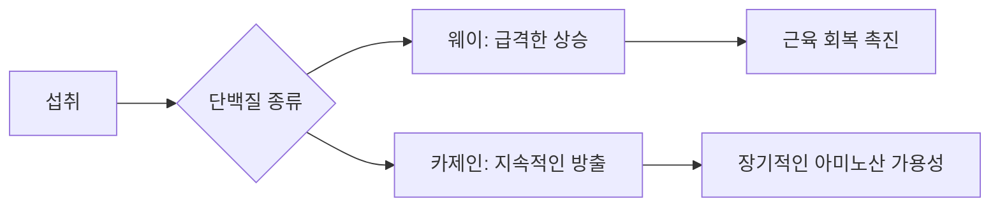

# 우유 단백질의 과학: 웨이(Whey), 아이솔레이트(Isolate), 카제인(Casein) 완벽 가이드

보충제 매장을 방문하거나 피트니스 관련 제품을 둘러보다 보면, 수많은 단백질 파우더의 종류에 압도당하기 마련입니다. "웨이(Whey)", "아이솔레이트(Isolate)", "카제인(Casein)"과 같은 용어들은 자주 사용되지만, 이들 사이의 생화학적 차이는 종종 잘못 이해되곤 합니다. 이들은 모두 '우유'라는 동일한 원천에서 유래하지만, 체내에 들어갔을 때 작용하는 방식은 매우 다릅니다.

이러한 단백질의 차이를 이해하는 것은 단순히 근육을 키우는 것을 넘어, 우리 몸이 아미노산을 처리하는 방식, 소화 속도의 차이, 그리고 개인의 라이프스타일 목표에 맞춰 영양 섭취를 최적화하는 방법을 배우는 과정입니다.

## 유제품의 기초: 우유가 파우더가 되기까지

우유는 주로 물로 구성되어 있지만, 고형분은 크게 두 가지 단백질 그룹으로 나뉩니다. 바로 **카제인(Casein, 우유 단백질의 약 80%)**과 **웨이(Whey, 약 20%)**입니다.

역사적으로 웨이는 치즈 제조 과정에서 발생하는 부산물로 여겨졌습니다. 수 세기 동안 치즈 제조자들은 우유를 응고시켜 치즈를 만들고 남은 액체(유청)를 버리곤 했습니다. 20세기 후반에 이르러서야 식품 과학자들은 이 액체가 α-락트알부민을 포함한 필수 아미노산을 함유한 고품질의 완전 단백질원이라는 사실을 발견했습니다.

### 소화 메커니즘
이 단백질들의 가장 큰 차이는 소화 속도와 소화 과정에서의 물리적 상태에 있습니다.

*   **웨이 단백질(Whey Protein):** "빠르게 흡수되는" 단백질로 알려져 있습니다. 치즈 생산의 액체 부산물에서 분리된 단백질 혼합물입니다. 섭취 후 빠르게 처리되어 혈중 아미노산 농도를 급격히 높입니다. 이러한 특성 때문에 신속한 아미노산 공급이 필요한 운동 직후 회복을 위해 가장 많이 선택됩니다.
*   **카제인 단백질(Casein Protein):** "느리게 흡수되는" 또는 "지속 방출형" 단백질로 알려져 있습니다. 카제인이 위장의 산성 환경에 도달하면 응고되어 젤이나 "덩어리" 형태가 됩니다. 이러한 물리적 변화는 분해 과정을 늦추어, 웨이에 비해 더 오랜 시간 동안 혈류로 아미노산을 지속적으로 공급하게 합니다.

## 단백질 프로필 비교

자신에게 맞는 단백질을 선택하려면 가공 수준을 살펴봐야 합니다. 웨이 농축유청단백(Concentrate)은 가장 기본적인 형태이며, 아이솔레이트(Isolate)는 지방과 유당을 제거하기 위해 추가적인 여과 과정을 거칩니다.

| 구분 | 웨이 농축(Concentrate) | 웨이 아이솔레이트(Isolate) | 카제인(Casein) |
| :--- | :--- | :--- | :--- |
| **단백질 함량** | 70–80% | 90% 이상 | 80% |
| **소화 속도** | 빠름 | 매우 빠름 | 느림 |
| **유당 함량** | 보통 | 낮음/없음 | 보통 |
| **최적 활용 시기** | 일반적인 단백질 섭취 | 운동 직후/유당 민감자 | 취침 전/장시간 공복 |
| **가격** | 합리적 | 프리미엄 | 보통/프리미엄 |

### 웨이 아이솔레이트: 정제된 선택
웨이 아이솔레이트는 단백질을 지방 및 유당(우유 설탕)으로부터 분리하기 위해 설계된 고급 여과 공정을 통해 생산됩니다. 일반적인 웨이 농축 단백질 섭취 시 소화 불편을 겪는 사람들에게는 유당 함량이 현저히 낮은 아이솔레이트가 종종 선호되는 해결책입니다.

### 카제인: "취침 전" 단백질
느린 소화 특성 때문에 카제인은 수면 시간과 같이 장기간 공복 상태가 유지되는 동안 아미노산을 꾸준히 공급받고자 하는 운동선수들이 주로 활용합니다.

## 실전 적용: 언제 무엇을 먹어야 할까?

영양 전략을 설계할 때 다음의 "단백질 타임라인"을 고려해 보십시오.

1.  **아침/운동 직후:** **웨이 아이솔레이트 또는 농축 단백질**을 사용하십시오. 신체에 영양분이 필요한 상태이므로, 웨이의 빠른 흡수 프로필이 아미노산 공급을 원활하게 돕습니다.
2.  **낮 시간:** 어떤 것을 선택해도 무방하지만, 간편하게 쉐이크로 마시기에는 웨이가 일반적으로 더 편리합니다.
3.  **취침 전:** **카제인**을 사용하십시오. 밤새 느리고 지속적인 아미노산 방출을 제공하여 수면 중 영양 요구를 충족시킵니다.

### 인포그래픽: 단백질 흡수 곡선

*참고: 위에서 언급된 흡수율은 표준 생리학적 모델을 기반으로 합니다. 개인의 대사 속도, 장내 미생물 건강, 다른 다량 영양소의 존재 여부가 이러한 타임라인에 영향을 줄 수 있습니다. 이 내용은 일반적인 가이드라인으로 보아야 합니다.*

## 역사적 배경과 현대적 트렌드
단백질 보충제 산업의 성장은 20세기 후반 피트니스 붐의 산물입니다. 보디빌딩이 소수 문화에서 주류 라이프스타일로 전환되면서, 간편하고 고품질인 단백질에 대한 수요가 웨이 추출의 산업화를 이끌었습니다. 오늘날 우리는 다양한 단백질 공급원으로의 변화를 목격하고 있지만, 우유 유래 단백질은 완전한 아미노산 프로필과 높은 생체 이용률 덕분에 여전히 "골드 스탠다드"로 남아 있습니다.

제품을 선택할 때는 항상 라벨에서 첨가물을 확인하십시오. 고품질 아이솔레이트 제품은 성분 목록이 간결해야 합니다. 만약 제품에 과도한 말토덱스트린이나 인공 증점제가 포함되어 있다면, 고품질 단백질이 아닌 탄수화물에 비용을 지불하고 있을 가능성이 있습니다.

결국 단백질은 하나의 도구입니다. 웨이를 선택할지 카제인을 선택할지는 여러분의 일정과 신체의 유제품 내성 여부에 달려 있습니다. 이러한 단백질 섭취 타이밍을 마스터함으로써 근육 생성, 제지방 유지, 혹은 단순히 일일 영양 요구량 충족 등 여러분의 신체적 목표를 더 효과적으로 지원할 수 있습니다.

## 참고자료

- [Whey protein](https://en.wikipedia.org/wiki/Whey%20protein)
- [Protein quality](https://en.wikipedia.org/wiki/Protein%20quality)
- [Index of protein-related articles](https://en.wikipedia.org/wiki/Index%20of%20protein-related%20articles)
- [Alligator](https://en.wikipedia.org/wiki/Alligator)
- [Gelation of single heated vs. double heated whey protein isolate](https://doi.org/10.1016/j.idairyj.2005.10.024)
- [Modification of Micellar Casein Isolate Alters Protein Degradation Pathways and Peptide Generation during In Vivo Gastrointestinal Digestion](https://doi.org/10.1021/acs.jafc.6c00266.s001)
- [Structure-Based Development of Isoform-Selective Inhibitors of Casein Kinase 1 vs Casein Kinase 1](https://doi.org/10.1021/acs.jmedchem.2c01180.s002)