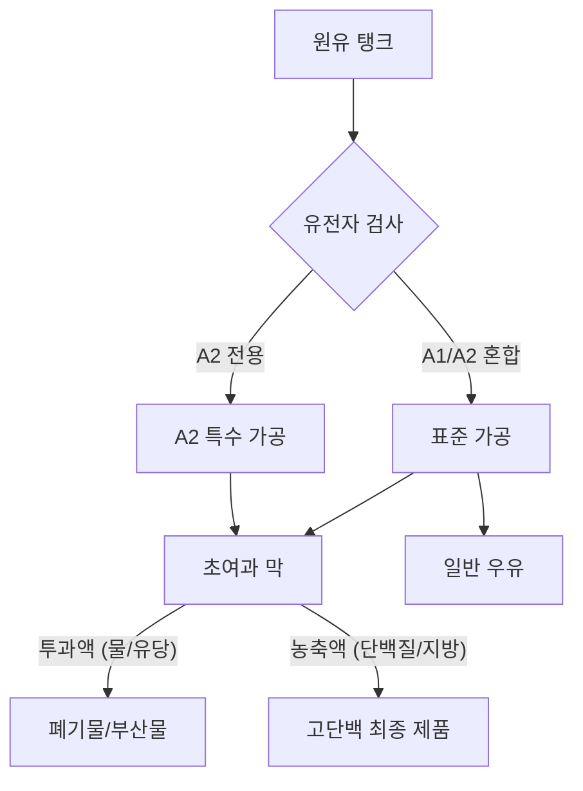

# 우유 그 이상의 가치: A2 우유와 고단백 여과 기술의 이해

지난 10년간 유제품 코너는 조용한 혁명을 겪었습니다. 과거에는 지방 함량에 따라 구분되던 단순한 상품 진열대였지만, 이제는 기능성 우유가 주를 이루는 전문적인 공간으로 탈바꿈했습니다. 이 시장에서 가장 두드러진 변화는 'A2 우유'의 등장과 페어라이프(Fairlife)와 같은 브랜드로 대중화된 '초여과(Ultra-filtered)' 고단백 우유의 확산입니다. 두 제품 모두 소젖에서 유래하지만, 그 차이는 단백질의 근본적인 생물학적 특성과 현대 낙농 기술의 기계적 공정에 있습니다.

## A2 우유의 차이: 유전적 선별과 소화 편의성

A2 우유를 이해하려면 먼저 우유의 주요 단백질인 카세인(Casein)에 대해 알아야 합니다. 카세인은 우유 단백질의 약 80%를 차지하며, 여러 변형 형태로 존재합니다. 베타-카세인의 가장 흔한 두 가지 형태는 A1과 A2입니다.

### 역사적 및 생물학적 배경
역사적으로 모든 소는 베타-카세인 단백질 중 A2 변이형만을 생산했습니다. 수천 년 전 유럽 소 떼에서 유전자 돌연변이가 발생하면서 A1 베타-카세인 변이형이 나타나기 시작했습니다. 시간이 흐르며 선택적 번식을 통해 서구권의 많은 상업용 젖소 농장에서는 A1이 지배적인 변이형이 되었습니다.

A1과 A2의 주요 차이는 단 하나의 아미노산 서열에 있습니다. A1 단백질이 소화될 때 '베타-카소모르핀-7(BCM-7)'이라는 펩타이드가 생성됩니다. 일부 연구에 따르면 BCM-7은 특정 개인에게 소화 불편을 유발할 수 있으며, 복부 팽만감이나 통증 등 유당 불내증과 유사한 증상을 일으킬 수 있다고 합니다. A2 베타-카세인만 생산하도록 유전자 검사를 거친 소에서 얻은 A2 우유는 소화 과정에서 BCM-7을 생성하지 않습니다.

### 과학적 논쟁
A2 우유에 대한 과학적 합의는 여전히 진행 중이라는 점을 유념해야 합니다. 지지자들은 A2 우유가 '유제품 민감성(진정한 유당 알레르기나 불내증과는 구별됨)'을 겪는 사람들에게 소화가 더 쉽다고 주장하지만, 많은 임상 연구는 여전히 결론을 내리지 못하고 있습니다. 일부 연구자들은 이러한 이점이 플라세보 효과 때문일 수 있거나, 우유와 관련된 불편함이 유당 함량이나 A1 단백질과 다른 요인들의 상호작용 때문일 가능성이 높다고 지적합니다.

## 고단백 우유의 공학: 초여과(Ultra-filtration) 기술

A2 우유가 유전적 선별의 산물이라면, 페어라이프와 같은 브랜드는 식품 공학의 승리를 보여줍니다. 이러한 우유의 높은 단백질 함량은 단백질 파우더를 첨가해서 얻는 것이 아니라, 막 여과(Membrane filtration) 기술을 통해 우유 성분을 물리적으로 분리하여 얻어집니다.

### 초여과 메커니즘
이 공정을 '초여과'라고 합니다. 이 기술은 우유를 일련의 미세한 메쉬 막(Membrane)에 통과시키는 과정을 포함합니다. 이 막은 선택적 투과성을 지녀 물, 비타민, 미네랄, 유당은 통과시키고, 더 큰 단백질과 지방 분자는 걸러냅니다.

수분과 유당의 일부를 제거함으로써 남은 성분, 특히 단백질의 농도가 크게 증가합니다. 이것이 바로 초여과 우유가 일반 우유보다 단백질 함량이 높은 이유입니다. 유당이 물리적으로 걸러지기 때문에, 이러한 우유는 자연스럽게 유당이 제거된 상태가 되어 A1/A2 단백질 유형과 관계없이 유당 민감성이 있는 사람들에게 훌륭한 선택지가 됩니다.

### 비교표: 일반 우유 vs. A2 우유 vs. 초여과 우유

| 특징 | 일반 우유 | A2 우유 | 초여과 우유 (예: 페어라이프) |
| :--- | :--- | :--- | :--- |
| **단백질 공급원** | A1 & A2 혼합 | A2 전용 | A1 & A2 혼합 (일반적) |
| **단백질 수준** | 표준 (~8g/컵) | 표준 (~8g/컵) | 높음 |
| **유당 함량** | 표준 | 표준 | 낮음/없음 (여과 제거) |
| **주요 이점** | 영양 기초 | 잠재적 소화 편의성 | 고단백, 저당 |
| **생산 방식** | 표준 저온살균 | 유전적 선별 | 막 여과 |

## 유제품 가공 흐름 시각화

다음 다이어그램은 낙농 공급망 내에서 이 두 가지 범주가 어떻게 생산되는지 보여줍니다.

## 소비자를 위한 실질적 고려 사항

이 제품들 사이에서 선택할 때는 자신의 건강 목표와 소화 필요성에 따라 결정해야 합니다.

1. **소화 불편을 겪는 경우:** 먼저 문제가 유당과 관련된 것인지 확인해야 합니다. 유당 불내증이 있다면 유당이 물리적으로 제거된 초여과 우유(페어라이프 등)가 가장 좋은 선택일 가능성이 높습니다. 유당은 문제없지만 유제품 섭취 후 복부 팽만감을 느낀다면, A1 단백질이 원인인지 확인하기 위해 A2 우유를 시도해 볼 가치가 있습니다.
2. **운동 효과를 기대하는 경우:** 근육 회복과 포만감을 위해 초여과 우유가 선호되는 경우가 많습니다. 칼로리 대비 단백질 밀도가 높아 과도한 당분 섭취 없이 일일 단백질 섭취량을 늘리려는 운동선수나 일반인들에게 인기 있는 옵션입니다.
3. **비용 및 가용성:** A2 우유와 초여과 우유 모두 일반 우유보다 가격이 높다는 점을 인지해야 합니다. 이는 A2 소 떼를 위한 유전자 검사 비용과 초여과 막 기술에 필요한 막대한 자본 투자 비용 때문입니다.

## 결론

유제품 코너의 진화는 식품 과학의 더 넓은 흐름, 즉 기능성 영양으로의 이동을 반영합니다. A2 우유는 소화 민감성을 해결하기 위해 단백질의 특정 생물학적 상호작용을 공략하며, 초여과 우유는 제품의 영양 프로필을 조작하기 위해 첨단 여과 기술을 활용합니다. 이러한 차이를 이해하면 소비자는 단순히 라벨에 의존하지 않고, 자신의 생리학적 필요와 라이프스타일 목표에 가장 잘 맞는 우유를 선택할 수 있습니다.

## 참고자료

- [Milk](https://en.wikipedia.org/wiki/Milk)
- [January–March 2023 in science](https://en.wikipedia.org/wiki/January%E2%80%93March%202023%20in%20science)
- [American and British English spelling differences](https://en.wikipedia.org/wiki/American%20and%20British%20English%20spelling%20differences)
- [Alligator](https://en.wikipedia.org/wiki/Alligator)
- [Science or Snake Oil: is A2 milk better for you than regular cow’s milk?](https://doi.org/10.64628/aa.ehmteyhu9)
- [To sell the cow and drink the milk: How could China harmonize its growth and risk?](https://doi.org/10.37473/dac/10.1002/ijfe.2306)
- [To sell the cow and drink the milk: How could China harmonize its growth and risk?](https://doi.org/10.37473/fic/10.1002/ijfe.2306)