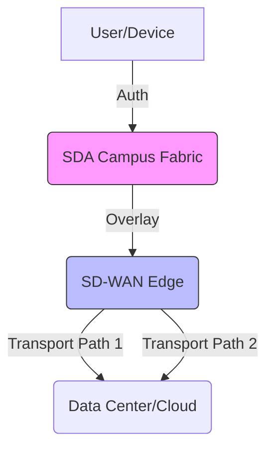

# 현대 네트워크의 이해: SDA와 SD-WAN의 차이점

엔터프라이즈 네트워킹 환경이 진화함에 따라, 아키텍처 논의에서 자주 등장하는 두 가지 핵심 용어가 있습니다. 바로 **SDA(Software-Defined Access)**와 **SD-WAN(Software-Defined Wide Area Network)**입니다. 두 기술 모두 제어 평면(Control Plane)과 데이터 평면(Data Plane)을 분리하는 SDN(Software-Defined Networking)의 원리를 활용하지만, 조직의 인프라 내에서 수행하는 역할은 근본적으로 다릅니다.

시스코(Cisco)는 **Catalyst Center**(구 DNA Center)를 SDA 패브릭의 관리 엔진으로 활용합니다. 이 기술이 엔터프라이즈 연결성이라는 큰 그림 속에서 어떻게 위치하는지 이해하려면, 캠퍼스 내부와 광역 네트워크(WAN)라는 서로 다른 영역에 대한 깊이 있는 통찰이 필요합니다.

## Software-Defined Access (SDA): 캠퍼스 패브릭

Software-Defined Access는 사용자, 장치 및 사물에 대해 자동화된 정책 기반 액세스를 제공하는 캠퍼스 전역의 패브릭 구현입니다. 이는 기존의 "VLAN 중심" 캠퍼스 네트워크가 통합된 프로그래밍 가능 환경으로 진화한 형태입니다.

### SDA의 작동 원리
SDA의 핵심은 네트워크 가상화를 제공하기 위해 **VXLAN(Virtual Extensible LAN)** 오버레이에 의존한다는 점입니다. 복잡한 레이어 2 스패닝 트리 프로토콜이나 액세스 스위치의 수동 구성에 의존하는 기존 네트워크와 달리, SDA는 **Cisco Catalyst Center**를 "두뇌"로 사용합니다.

1.  **Underlay(언더레이):** 스위치 간의 물리적 연결성(IP 도달 가능성)을 의미합니다.
2.  **Overlay(오버레이):** 사용자 트래픽을 전달하는 논리적 네트워크(VXLAN 터널)입니다.
3.  **Control Plane(제어 평면):** LISP(Locator/ID Separation Protocol)를 기반으로 하며, 네트워크 내에서 엔드포인트의 위치와 ID를 분리합니다.
4.  **Policy Plane(정책 평면):** Cisco TrustSec을 사용하여 SGT(Scalable Group Tags)를 적용합니다. 관리자는 수천 개의 IP 기반 ACL을 관리하는 대신, 사용자 역할(예: "계약직", "직원", "IoT 장치")에 따라 보안 정책을 관리합니다.

### 역사적 배경
SDA 이전의 캠퍼스 네트워크는 CLI(Command Line Interface)를 통해 수동으로 구성되었습니다. 규모가 커질수록 수백 대의 개별 장치를 관리해야 하는 부담이 컸습니다. SDA로의 전환은 조직이 VRF-Lite나 복잡한 방화벽 우회(Hair-pinning)의 오버헤드 없이 "매크로 세그멘테이션(가상 네트워크)"과 "마이크로 세그멘테이션(가상 네트워크 내 보안)"을 요구하면서 시작되었습니다.

## SD-WAN: 분산된 엔터프라이즈 연결

SDA가 건물 "내부"를 담당한다면, SD-WAN은 건물과 건물 "사이"를 담당합니다. SD-WAN은 기존의 MPLS 회선을 대체하거나 보완하기 위해 설계되었으며, 광대역, LTE/5G 및 전용 인터넷 회선을 활용하는 전송 방식에 구애받지 않는(transport-agnostic) 오버레이를 제공합니다.

### SD-WAN의 기능
SD-WAN은 전송 계층을 추상화합니다. 사용 가능한 모든 경로의 상태(지연 시간, 지터, 패킷 손실)를 실시간으로 모니터링합니다. 만약 주 MPLS 회선의 품질이 저하되면, SD-WAN 에지 장치는 비즈니스 핵심 트래픽을 자동으로 보조 경로(공용 광대역 연결이라 할지라도)로 즉시 전환합니다.

*   **중앙 집중식 오케스트레이션:** SDA의 Catalyst Center와 유사하게, SD-WAN은 중앙 컨트롤러(예: Cisco vManage)를 사용하여 수천 개의 지점에 보안 및 라우팅 정책을 동시에 배포합니다.
*   **애플리케이션 인식 라우팅:** 네트워크가 단순히 IP 주소만 보는 것이 아니라 애플리케이션을 식별하므로, 지능적인 경로 선택이 가능합니다.

## 비교표: SDA vs. SD-WAN

| 기능 | SDA (Software-Defined Access) | SD-WAN |
| :--- | :--- | :--- |
| **주요 범위** | 캠퍼스 및 지점 (LAN) | WAN (지점 간 또는 클라우드 연결) |
| **핵심 프로토콜** | VXLAN / LISP | IPsec / GRE / BGP |
| **주요 목표** | 사용자 이동성 및 세그멘테이션 | 성능 및 비용 효율적인 연결 |
| **관리 도구** | Cisco Catalyst Center | Cisco vManage (SD-WAN 컨트롤러) |
| **세그멘테이션** | SGT (Scalable Group Tags) | VPNs / VRFs |

## 실무 예시: 사무실에서의 하루

글로벌 소매 체인을 상상해 보십시오.
*   **매장 내부 (SDA):** 관리자가 노트북을 스위치에 연결하면, SDA 패브릭이 802.1X 인증을 통해 사용자를 인식합니다. 시스템은 즉시 해당 사용자를 "관리(Management)" SGT로 할당합니다. 관리자가 다른 층이나 건물로 이동하더라도 보안 정책은 자동으로 따라갑니다.
*   **매장 간 연결 (SD-WAN):** 매장에서 데이터 센터로 재고 데이터를 전송해야 합니다. SD-WAN 에지 장치는 주 MPLS 링크가 혼잡함을 감지합니다. 장치는 트래픽을 지능적으로 분할하여, 우선순위가 높은 재고 데이터는 MPLS 링크로 보내고, 덜 중요한 게스트 Wi-Fi 트래픽은 더 저렴한 광대역 연결을 통해 전송합니다.

## 향후 전망
업계는 SD-WAN과 클라우드 네이티브 보안을 통합하려는 "SASE(Secure Access Service Edge)" 방향으로 나아가고 있지만, 캠퍼스 패브릭과 WAN 에지 사이에는 여전히 뚜렷한 경계가 존재합니다. 시스코가 이러한 관리 플랫폼들을 통합하고는 있으나, 이들은 여전히 서로 다른 아키텍처 도메인이라는 점을 유의해야 합니다. 일부 업계 분석가들은 의도 기반 네트워킹(Intent-based Networking)이 성숙해짐에 따라 향후 10년 내에 LAN과 WAN 관리의 경계가 더욱 모호해질 것으로 예측하지만, 현재로서는 특정 문제를 해결하기 위한 전문화된 도구로 남아 있습니다.

## 참고자료

- [Comparison](https://en.wikipedia.org/wiki/Comparison)
- [Comparison of ICBMs](https://en.wikipedia.org/wiki/Comparison%20of%20ICBMs)
- [Comparison theorem](https://en.wikipedia.org/wiki/Comparison%20theorem)
- [ADARA Networks](https://en.wikipedia.org/wiki/ADARA%20Networks)
- [An Introduction to SD-WAN](https://doi.org/10.1007/978-1-4842-7347-0_1)
- [Learning SD-WAN with Cisco](https://doi.org/10.1007/978-1-4842-7347-0)
- [Troubleshooting](https://doi.org/10.1007/978-1-4842-7347-0_14)