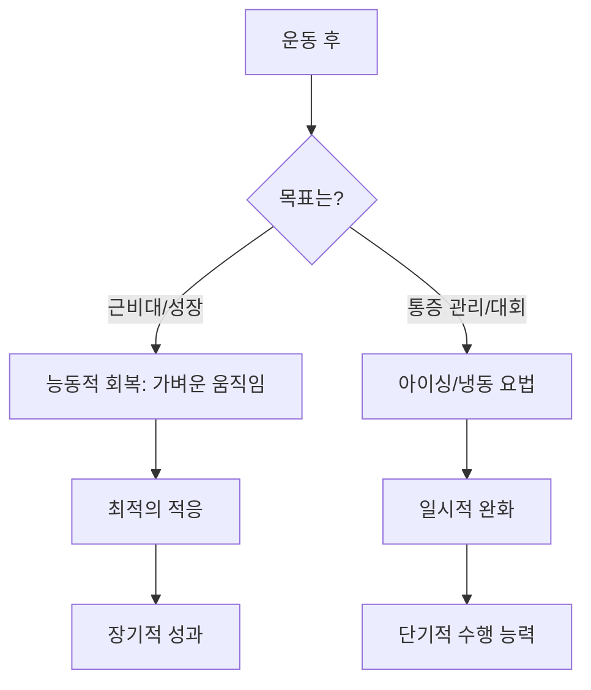

# 차가운 진실: 아이싱은 정말로 염증을 줄이고 회복을 도울까?

수십 년 동안 'R.I.C.E.'(Rest: 휴식, Ice: 냉찜질, Compression: 압박, Elevation: 거상)는 스포츠 부상 치료와 운동 후 근육통 관리의 표준으로 자리 잡아 왔습니다. 물리치료실을 방문했거나 고강도 경기 후 벤치에 앉아 있을 때, 누군가 건네준 아이스팩을 사용해 본 경험이 한 번쯤은 있을 것입니다. 하지만 최근 스포츠 과학 연구들은 아이싱이 염증과 회복을 위한 최고의 만병통치약이라는 오랜 믿음에 의문을 제기하기 시작했습니다.

아이싱은 기적의 치료법일까요, 아니면 오히려 당신의 성장을 방해하고 있는 것일까요? 이 질문에 답하기 위해 우리는 냉동 요법(cryotherapy)의 생리학적 기전을 살펴보고, 급성 부상 관리와 장기적인 회복 전략을 구분해야 합니다.

## 기전: 냉기가 조직에 미치는 영향

피부에 얼음을 대면 '혈관 수축'이라는 생리학적 반응이 일어납니다. 해당 부위를 차갑게 함으로써 국소 혈류량을 줄이는 것입니다. 과거에는 이것이 '2차 세포 사멸'을 방지하고 부기를 최소화한다고 생각했습니다.

그러나 현대 연구에 따르면 염증은 부상의 부산물이 아니라 치유 과정의 핵심 요소입니다. 운동 중 근육이 손상(미세 파열)되면, 우리 몸은 잔해를 제거하고 조직 재생을 시작하기 위해 염증 반응을 일으킵니다. 냉동 요법이 통증 완화와 염증 감소에는 효과가 있을지 몰라도, 전체적인 회복에 미치는 효과는 제한적입니다. 과도한 아이싱은 근육 비대와 적응에 필요한 신호 전달 경로를 차단할 수 있습니다.

### RICE vs. PEACE & LOVE 패러다임
스포츠 의학계는 점차 R.I.C.E.에서 **PEACE & LOVE**(Protection: 보호, Elevation: 거상, Avoid Anti-inflammatories: 항염증제 피하기, Compression: 압박, Education & Load: 교육 및 부하, Optimism: 낙관주의, Vascularization: 혈관 형성, Exercise: 운동)와 같은 새로운 프로토콜로 이동하고 있습니다. 이러한 변화는 아이싱이 일시적인 통증 완화는 제공할 수 있지만, 장기적인 조직 재생에는 최적의 방법이 아닐 수 있음을 강조합니다.

| 특징 | 아이싱 (R.I.C.E.) | 능동적 회복 (PEACE & LOVE) |
| :--- | :--- | :--- |
| **주요 목표** | 통증 억제 및 혈관 수축 | 조직 재구성 및 혈류 개선 |
| **염증** | 적극적으로 억제 | 치유의 일부로 관리 |
| **근성장** | 적응을 방해할 수 있음 | 세포 재생 촉진 |
| **최적 활용** | 급성 통증, 즉각적인 외상 | 운동 후 근육통 (DOMS) |

## 역사적 배경과 현대 과학

R.I.C.E. 프로토콜은 1978년에 대중화되었습니다. 그 이후 근육 회복에 대한 과학적 이해는 크게 발전했습니다. 지연성 근육통(DOMS)에 대한 연구에 따르면, 수동적 휴식과 비교했을 때 전신 냉동 요법이 DOMS를 줄이거나 회복 기간을 단축하는지에 대해서는 여전히 연구가 진행 중입니다. 또한, 연구들은 DOMS 상태에서 편심성 운동(eccentric exercise)을 수행하는 것이 반드시 근육 손상을 악화시키지는 않는다는 점을 시사하며, 우리 몸이 R.I.C.E. 프로토콜이 가정했던 것보다 훨씬 더 회복력이 강하다는 것을 보여줍니다.

이러한 역사적 전환은 스포츠 과학의 더 큰 흐름, 즉 단순한 '증상 관리'에서 '생물학적 최적화'로 나아가는 변화를 잘 보여줍니다.

## 실용적 적용: 아이싱을 해야 할 때와 피해야 할 때

운동선수라면 아이싱 여부는 전적으로 자신의 목표에 달려 있습니다.

1. **"엘리트 퍼포먼스" 시나리오:** 하루에 여러 경기를 치러야 하는 토너먼트 대회에 참가하는 프로 선수라면 통증 관리가 최우선입니다. 이 경우 아이싱은 다음 경기를 뛰기 위해 사용할 수 있는 유효한 도구입니다.
2. **"근비대/근력 강화" 시나리오:** 근육량을 늘리거나 근력을 향상하는 것이 목표라면, 저항 운동 후 아이싱을 할 때 주의해야 합니다. 적응을 자극하기 위해 자연스러운 염증 반응이 일어나도록 두어야 하기 때문입니다.
3. **"급성 부상" 시나리오:** 심각한 염좌나 근육 파열을 겪었다면, 첫 24~48시간 동안의 아이싱은 통증 관리에 도움이 될 수 있지만, 절제해서 사용해야 합니다.

### 권장 회복 워크플로우

## 결론: 아이싱에 대한 판결

아이싱은 '틀린' 것이 아니라, 종종 '잘못 사용'되고 있습니다. 아이싱은 즉각적인 편안함을 제공하는 강력한 진통제이지만, 신체적 적응을 원하는 사람들에게는 회복 촉진제가 아닙니다. 더 강해지거나 근육을 키우는 것이 목표라면, 몸이 자연스러운 염증 과정을 겪도록 내버려 두어야 합니다. 만약 고된 토너먼트 일정을 버티는 것이 목표라면, 아이싱은 여전히 유용한 도구입니다. 냉동 요법보다는 가벼운 걷기, 가동성 운동, 적절한 영양 섭취와 같은 능동적 회복을 우선시하십시오.

## 참고자료

- [Cryotherapy](https://en.wikipedia.org/wiki/Cryotherapy)
- [Delayed onset muscle soreness](https://en.wikipedia.org/wiki/Delayed%20onset%20muscle%20soreness)
- [Ice bath](https://en.wikipedia.org/wiki/Ice%20bath)
- [Effectiveness](https://en.wikipedia.org/wiki/Effectiveness)
- [Does Endurance Training Inhibit Muscle Growth?](https://doi.org/10.1007/978-3-662-68048-3_15)
- [Increasing Muscle Hypertrophy with a Natural Product Designed to Inhibit SIRT1](https://doi.org/10.1101/2022.06.27.497838)
- [Increasing Muscle Hypertrophy with a Natural Product Designed to Inhibit SIRT1](https://doi.org/10.21203/rs.3.rs-1855726/v1)