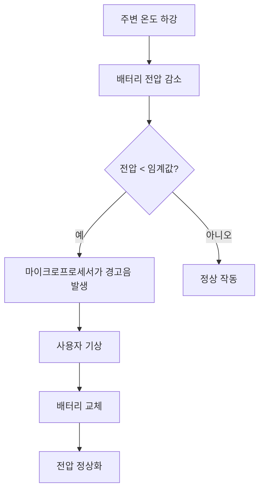

# 한밤중의 경고음: 화재 감지기가 새벽 3시에 울리는 이유

마치 저예산 공포 영화의 한 장면 같은 경험이 있습니다. 온 집안이 고요한 새벽 3시 14분, 갑자기 천장에서 날카롭고 짧은 "삐-" 소리가 울려 퍼집니다. 잠결에 비몽사몽하며 짜증 섞인 채 침대에서 일어나 보면, 화재 감지기가 배터리 부족을 알리고 있다는 사실을 깨닫게 되죠. 도대체 왜 이런 일은 항상 깊은 밤에만 일어나는 걸까요? 기기가 당신의 수면 패턴을 방해하려는 걸까요, 아니면 이 야간 소음에는 과학적인 이유가 있는 걸까요?

## 온도와 배터리 화학의 물리학

화재 감지기가 밤에 경고음을 내는 주된 이유는 기기가 사용자의 휴식을 방해하려는 의도가 있어서가 아니라, 열역학 법칙과 배터리 화학의 기본 원리 때문입니다. 대부분의 가정용 화재 감지기는 9V 알카라인 또는 리튬 배터리로 작동하며, 이 배터리들은 화학 반응을 통해 전기 에너지를 생성합니다.

집안의 주변 온도가 낮아지면(보통 늦은 밤이나 이른 새벽에 발생), 배터리 내부의 화학 반응 속도가 느려집니다. 이는 내부 저항과 관련된 현상으로, 온도가 내려감에 따라 배터리의 전압 출력도 함께 떨어지게 됩니다.

만약 배터리 수명이 거의 다 되어가는 상태라면, 평소에는 '배터리 부족' 임계값 근처에서 아슬아슬하게 작동하고 있을 것입니다. 낮 동안 집안 온도가 높을 때는 배터리가 감지기를 작동시키기에 충분한 전압을 제공하지만, 밤이 되어 집안 온도가 내려가면 전압이 임계값 아래로 떨어지면서 배터리 부족 경고 시스템이 작동하게 됩니다. 그러다 해가 뜨고 집안 온도가 다시 올라가면 전압이 약간 회복되어 경고음이 멈추고, 다음 날 밤에 이 과정이 반복되는 것입니다.

### 화재 감지기 배터리 유형별 특성 비교

| 배터리 유형 | 일반적인 수명 | 온도 민감도 | 경고음 발생 패턴 |
| :--- | :--- | :--- | :--- |
| **알카라인 (9V)** | 6–12개월 | 높음 | 전압 강하로 인한 잦은 야간 경고음 발생 |
| **리튬 (10년형)** | 10년 | 낮음 | 기기 수명 종료 임박 시를 제외하고는 거의 발생 안 함 |
| **유선 연결 (배터리 백업 포함)** | 5–10년 | 보통 | 전력 서지나 백업 오류로 인해 경고음 발생 가능 |

## 역사적 배경과 엔지니어링 설계

흔히 화재 경보기라고도 불리는 화재 감지기는 초기 모델 이후 크게 발전했습니다. 이 장치들은 일반적으로 연기가 감지되면 기기 자체나 연결된 여러 감지기에서 소리나 시각적 경보를 발생시킵니다. 신뢰성을 보장하기 위해 엔지니어들은 전원 공급 상태를 포함한 기기의 상태를 모니터링하는 감시 회로를 구현했습니다.

이 "삐-" 소리는 의도적으로 눈에 띄게 설계되었습니다. 엔지니어링 철학은 간단합니다. 경고음이 조용하거나 듣기 좋았다면 집주인이 이를 무시할 수 있고, 결과적으로 집이 화재 위험에 노출될 수 있기 때문입니다. 제조사들은 고주파의 간헐적인 소리를 선택함으로써 사용자가 즉시 문제를 해결하도록 유도합니다. 이 경고음은 실제 화재 경보음과는 다르지만, 한밤중의 정적 속에서도 주의를 끌 만큼 충분히 지속되도록 설계되었습니다.

## 실용적인 문제 해결: 경고음 멈추는 법

현재 화재 감지기 경고음으로 고통받고 있다면, 다음 단계에 따라 체계적으로 문제를 해결해 보십시오.

1. **범인 찾기:** 여러 개의 감지기가 있다면 각각의 '일시 정지(hush)' 또는 '테스트(test)' 버튼을 눌러보세요. 경고음이 울리거나 다르게 깜빡이는 기기가 바로 조치가 필요한 대상입니다.
2. **"강제 재설정(Hard Reset)" 절차:** 때로는 감지기 내부 커패시터에 잔류 전하가 남아 있어 배터리를 교체한 후에도 배터리가 부족하다고 "착각"할 수 있습니다.
    *   천장에서 감지기를 분리합니다.
    *   배터리를 제거합니다.
    *   '테스트' 버튼을 15초 동안 길게 눌러 남아 있는 에너지를 방전시킵니다.
    *   새 배터리를 삽입하고 다시 설치합니다.
3. **먼지 확인:** 일부 모델에서는 감지 챔버 내부에 쌓인 먼지가 배터리 부족 신호와 유사한 오작동을 일으킬 수 있습니다. 압축 공기를 사용하여 통풍구의 먼지를 제거하십시오.
4. **유효 기간:** 화재 감지기는 일반적으로 10년의 수명을 가집니다. 기기가 10년 이상 되었다면 내부 센서의 수명이 다한 것이므로 기기 전체를 교체해야 합니다.

### 경고음 발생 논리 (Mermaid 다이어그램)

## 다른 원인이 있을까?

온도 변화로 인한 전압 강하가 가장 흔한 원인이지만, 유일한 원인은 아닙니다. 배터리를 교체했는데도 경고음이 계속된다면 다음 가능성을 고려해 보십시오.

* **전력 서지 (유선 연결형):** 화재 감지기가 가정용 전기 시스템에 직접 연결된 경우, 전력 서지나 느슨한 배선 연결이 기기에 펄스 신호를 유발할 수 있습니다.
* **오염된 센서:** 감지 챔버 내부의 곤충이나 거미줄이 유지보수 알림을 유발할 수 있습니다.
* **수명 종료 신호:** 많은 최신 감지기는 내부 센서가 더 이상 연기를 안정적으로 감지할 수 없을 때 경고음을 내도록 프로그래밍되어 있습니다. 이는 끌 수 없는 알림이며, 기기 전체를 교체해야 한다는 신호입니다.

이러한 설명은 업계 표준 관행에 기반하고 있지만, 개별 제조사의 사양에 따라 다를 수 있다는 점을 유의하십시오. 문제 해결 후에도 경고음이 계속된다면 반드시 해당 기기의 매뉴얼을 참조하십시오.

결론적으로, 새벽 3시의 경고음은 성가신 일이지만, 이는 매우 중요한 안전 기능입니다. 가장 신뢰할 수 있는 생명 보호 기술조차도 주기적인 유지보수가 필요하다는 사실을 상기시켜 주는 것이죠. 집안 온도와 배터리 화학 반응의 상호작용을 이해함으로써, 여러분의 집을 안전하게 지키고 방해받지 않는 편안한 잠자리를 유지하시기 바랍니다.

## 참고자료

- [Causes](https://en.wikipedia.org/wiki/Causes)
- [Causes of poverty](https://en.wikipedia.org/wiki/Causes%20of%20poverty)
- [Causes of cancer](https://en.wikipedia.org/wiki/Causes%20of%20cancer)
- [Smoke detector](https://en.wikipedia.org/wiki/Smoke%20detector)
- [Why Schizophrenics Smoke](https://doi.org/10.1126/article.32173)
- [Nocturia: Why do People Void at Night?](https://doi.org/10.26226/morressier.59b63e41d462b802923896e3)
- [Why do smoke alarms keep going off even when there’s no smoke?](https://doi.org/10.64628/aai.4c7kt43rh)